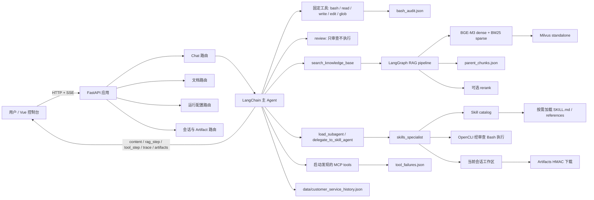
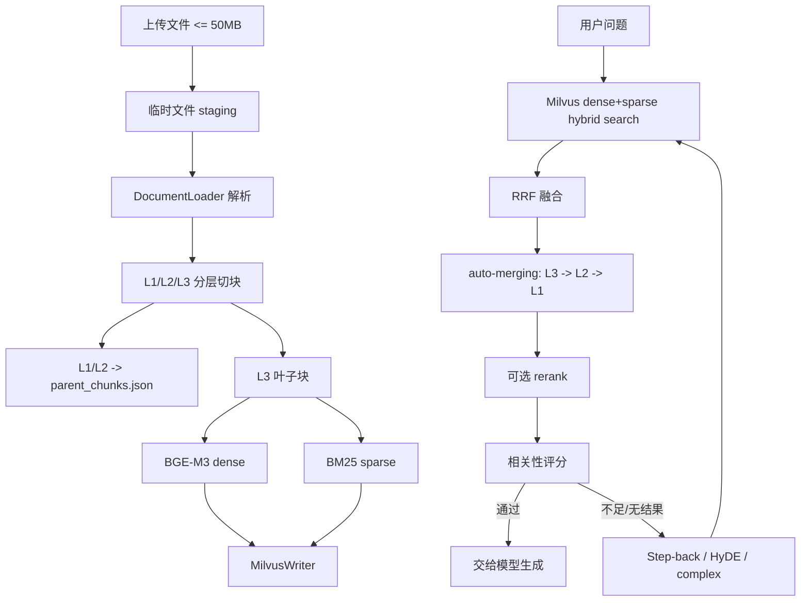

# Agent Console

Agent Console 是一个面向本地可信环境的 LangChain 多 Agent + RAG 工作台。它把对话模型、知识库、浏览器/桌面自动化、MCP 工具和本地文件工作区组合成一个可观察、可扩展的控制台。

项目的核心原则是“能力按需加载、工具有边界、过程可追踪”：主 Agent 只持有稳定的基础工具和路由能力；专业知识通过 Skills catalog 渐进加载；OpenCLI 等动态能力交给 Skills 小 Agent；知识库使用分层切块、dense+sparse 混合召回、RRF、auto-merging 和可选 rerank。

> 适用范围：个人开发机、内网实验环境和受信任的单机部署。当前没有账号/租户系统，也不是操作系统级安全沙箱。若部署到公网，必须在反向代理或身份层增加认证、限流和访问控制。

## 目录

- [核心亮点](#核心亮点)
- [系统架构](#系统架构)
- [OpenCLI Skill 详解](#opencli-skill-详解)
- [目录与文件职责](#目录与文件职责)
- [运行数据与持久化文件](#运行数据与持久化文件)
- [部署前置条件](#部署前置条件)
- [完整部署步骤](#完整部署步骤)
- [配置说明](#配置说明)
- [首次使用](#首次使用)
- [主要 API](#主要-api)
- [安全边界](#安全边界)
- [常见问题与排障](#常见问题与排障)
- [开发与测试](#开发与测试)

## 核心亮点

| 能力 | 说明 |
| --- | --- |
| 流式对话 | `/chat/stream` 使用 SSE 输出模型内容、内容分段边界、RAG 步骤、工具步骤、引用 trace 和会话产物。 |
| LangChain 主 Agent | 基于 `create_agent` 统一管理模型、工具、消息历史、同步调用和异步流式调用。 |
| Skills 渐进披露 | 启动时只扫描 `SKILL.md` 的 YAML 元数据；小 Agent 选中技能后才加载正文和 references，避免上下文膨胀。 |
| OpenCLI 封装 | 不把动态 registry 的大量命令硬编码成主 Agent 工具，而是以 `opencli` Skill + 审查 Bash 的方式调用。 |
| 动态 MCP | `backend/mcp_servers.json` 是 MCP server 的唯一配置源；启动时发现工具并转换为 LangChain tools。 |
| 分层 RAG | 文档生成 L1/L2 父块和 L3 叶子块；叶子块入 Milvus，父块保存在本地 DocStore，检索时自动向上合并上下文。 |
| 混合检索 | BGE-M3 dense embedding + BM25 sparse embedding + Milvus Hybrid Search + RRF 融合，可选接入 SiliconFlow rerank。 |
| 查询扩展 | 初始召回相关性不足时，LangGraph 自动选择 Step-back、HyDE 或 complex 策略再次召回。 |
| `.doc` 兼容 | `.docx` 走 OpenXML；旧版二进制 `.doc` 在 Windows 优先使用 Word COM，并降级到 LibreOffice/antiword。中文路径会先复制到 ASCII 临时路径。 |
| 会话工作区 | 每个 `user_id/session_id` 拥有独立的 `backend/tmp/<session-key>/`；脚本、缓存、预览等中间文件留在会话目录，最终产物统一放在其 `deliverables/` 子目录。 |
| 工具安全 | Bash 默认拒绝，执行顺序为 deny → authorize → allow → default deny；阻止路径逃逸、shell 拼接、危险系统命令和高风险 OpenCLI。 |
| 可观察但不扰人 | 前端展示当前对话实际产生的工具/RAG 轨迹和引用；没有引用时不展示检索轨迹。旧的“运行回调”只读页面和公开回调接口不再提供，失败记录仅留在服务端诊断文件。 |
| 调用上限 | 每轮对话最多执行 `AGENT_TOOL_CALL_LIMIT` 次工具调用，默认 250 次；达到上限会停止继续调用并整理已有结果。 |
| Plan-and-Execute | 对多步骤任务，先用规划器一次性拆解为有序子任务，再逐步执行；每完成一步就结合实际结果“反省”，必要时增删改后续计划。 |
| 长期记忆（mem0） | 基于 [mem0](https://github.com/mem0ai/mem0) 的跨会话用户记忆：每轮对话前检索相关记忆注入上下文，对话后自动蒸馏沉淀新记忆；记忆面板支持查看、手动新增、编辑与删除。 |

## 长期记忆（mem0）

主 Agent 通过 `backend/memory_service.py` 接入 mem0 长期记忆层，实现“跨会话还记得你”：

- **自动沉淀**：每轮对话结束后，后台把“用户消息 + Agent 回复”交给 mem0 的 LLM 抽取为结构化事实，并按语义去重/合并（`infer=True`）。
- **上下文召回**：新一轮对话开始前，用当前问题做语义检索，把最相关的几条长期记忆作为 system 消息注入，Agent 无需用户重复自我介绍。
- **本地化存储**：全部落在 `data/mem0/`（默认），包括本地 Qdrant 向量库与 SQLite 历史库；不依赖外部服务，模型使用项目已有的 `BAAI/bge-m3` 本地嵌入，DeepSeek 负责事实抽取。遥测默认关闭（`MEM0_TELEMETRY=False`）。
- **手动管理**：前端“记忆”面板调用 `/memory/*` 接口，可查看、新增（原文照存或 LLM 抽取）、编辑、删除、清空某用户的记忆。

相关配置（`.env`）：`MEMORY_ENABLED`（总开关）、`MEM0_DIR`（数据目录）、`MEM0_MODEL`（抽取模型，默认复用 `CHAT_MODEL`）、`MEM0_TOP_K`（每轮注入条数）。

> 安装说明：`mem0ai` 目前在 PyPI 上仍声明 `protobuf<7.0.0`，而本项目 Milvus/gRPC 栈需要 `protobuf>=7`。请用 `uv pip install --no-deps mem0ai==2.0.18` 安装 mem0ai 本体，再单独安装 `qdrant-client` / `posthog` / `pytz` / `portalocker`（均已写入 `pyproject.toml`，无版本冲突）。

## 系统架构

### 总体组件



### 启动生命周期

`backend/app.py` 的 FastAPI lifespan 按以下顺序初始化：

1. 在后台线程预热 BGE embedding 模型。
2. 校验模型实际输出维度是否等于 `MILVUS_DENSE_DIM`；不一致直接终止启动，避免向量维度污染集合。
3. 扫描 `AGENT_SKILLS_DIR`，建立 Skills catalog，并把元数据同步到 `backend/config.json`。
4. 读取 `backend/mcp_servers.json`，发现已启用 MCP server 的工具；失败只记录错误并继续启动。
5. 初始化 LangChain 主 Agent，把固定工具、Skills 工具、subagent 网关和已发现 MCP 工具装配到工具面。
6. 挂载 `frontend/` 静态文件，开始提供 Web 控制台。

推荐启动命令如下；它会正确触发 lifespan：

```powershell
uv run uvicorn backend.app:app --host 127.0.0.1 --port 8080
```

`main.py` 目前只是打印 LangChain 版本，不是 Web 服务入口。

### 对话与工具流程

1. 前端将 `message/user_id/session_id` POST 到 `/chat/stream`。
2. `ConversationStorage` 读取历史消息；历史过长时先摘要早期消息，并重置本轮 RAG/工具计数器。
3. 主 Agent 先自行判断是直接回答、查询知识库、使用本地工具、调用 MCP，还是委派给 `skills_specialist`。
4. 每次工具调用由 `tool_instrumentation.py` 包装，向 SSE 队列写入运行中、结果、错误或上限事件。
5. 主 Agent 的最终文本以 `content` 事件流式返回；模型节点变化时发送 `content_boundary`，前端将多个回答片段显示为独立消息块。
6. 回答结束后发送 `trace`（只有发生 RAG 时才有）和 `artifacts`，随后发送 `[DONE]`，并把消息、引用和文件清单持久化。

SSE 事件类型：

| 类型 | 含义 |
| --- | --- |
| `content` | 增量回答文本。 |
| `content_boundary` | 主 Agent 模型消息边界，前端开始新的回答片段。 |
| `rag_step` | 知识库召回、评分、改写、auto-merging 等阶段。 |
| `tool_step` | 工具开始、完成、失败或达到上限。 |
| `plan` | 规划器拆解出的子任务清单与各自状态。 |
| `plan_step` | 规划、执行、反省、完成等阶段的进度标记。 |
| `execute` | 单个子任务状态变更（in_progress / done / failed）。 |
| `reflect` | 反省结论（continue / complete / stop）与计划调整说明。 |
| `trace` | 完整 RAG trace 和引用片段。无知识库引用时不会发送。 |
| `artifacts` | 当前会话 `deliverables/` 目录中可下载的最终产物清单。 |
| `error` | 流式过程中发生的模型或工具错误。 |
| `[DONE]` | 流结束标记。 |

### RAG/知识库流程



文档上传的原子性规则：先把内容写入临时文件，成功解析并生成 L3 叶子块后才替换 `data/documents/<filename>`；随后删除同名旧向量并写入新向量。解析或入库失败时不会提前删除旧源文件，向量写入失败也会回滚同名新向量。支持格式为 `.pdf`、`.docx`、`.doc`、`.pptx`、`.ppt`、`.xlsx`、`.xls`、`.csv`、`.txt`。

## OpenCLI Skill 详解

### 为什么用 Skill 封装

OpenCLI 的 registry 是动态的，命令数量和参数会随版本、站点 adapter、浏览器扩展而变化。项目不把 1300+ 命令硬编码到主 Agent，而是把 OpenCLI 的使用规范、发现流程和安全边界封装到 `agent_workspace/skills/opencli`，由 `skills_specialist` 在需要时加载。

调用链是：

```text
主 Agent 判断需要网页/浏览器/下载能力
  -> delegate_to_skill_agent(完整任务)
  -> skills_specialist 阅读 catalog
  -> load_skill("opencli")
  -> read_skill_resource("opencli", "references/<name>.md")
  -> opencli list / --help 获取 live registry 与精确参数
  -> review / bash 进行权限审查和执行
  -> 返回证据、命令、权限级别和生成文件
```

### OpenCLI Skill 包结构

```text
agent_workspace/skills/opencli/
├── SKILL.md
├── agents/
│   └── openai.yaml
└── references/
    ├── app-control.md
    ├── browser.md
    ├── cli-surface.md
    ├── downloads.md
    ├── library-api.md
    ├── permissions.md
    ├── search-routing.md
    └── setup-and-doctor.md
```

| 文件 | 作用 |
| --- | --- |
| `SKILL.md` | 定义触发条件、发现优先工作流、Bash 执行要求、权限原则、浏览器 invariant 和结果报告格式。它要求先查 live registry，再读取精确 help，禁止凭记忆猜参数。 |
| `references/cli-surface.md` | 顶层 CLI、registry 查询、输出格式、通用参数、退出码和命令发现方式。 |
| `references/browser.md` | 浏览器 session、页面 `state`、refs 交互、extract、截图、网络请求和验证顺序。 |
| `references/search-routing.md` | 公开搜索、站点查询、热门/趋势和登录态网站之间的路由选择。 |
| `references/downloads.md` | 下载、导出、截图和缓存的落盘规则；要求输出到当前会话目录。 |
| `references/app-control.md` | Electron/CDP 和桌面应用控制，包括连接、窗口/页面状态和交互边界。 |
| `references/permissions.md` | OpenCLI 的 `read`、`write`、`P4` 等访问级别，以及哪些动作需要用户明确授权。 |
| `references/setup-and-doctor.md` | OpenCLI 安装、daemon、Browser Bridge、`opencli doctor` 和常见环境诊断。 |
| `references/library-api.md` | Node library/API exports 的查询方式，适合需要程序化调用而不是 CLI 的场景。 |
| `agents/openai.yaml` | Skill 在客户端中的展示名称、短描述和默认提示，不参与运行时工具执行。 |

### OpenCLI 的标准工作流

1. 初次或不熟悉的任务先运行 `opencli --version`、`opencli list -f json`。
2. 按意图、站点、`access`、`strategy` 和 `browser` 字段筛选，不把整个 registry 放入上下文。
3. 读取 `opencli <site-or-app> --help -f yaml` 和具体命令的 `--help -f yaml`。
4. 浏览器任务使用一个独立命名 session：先 `open/bind`，再读 `state`，使用返回的 refs 做一次交互，再读 `state` 验证。
5. 下载、导出、截图和缓存必须写入当前 `backend/tmp/<session-key>/`，并向主 Agent 返回相对路径。
6. 使用 `-f json` 执行并验证退出码和结果结构，最后报告实际命令、access 级别、验证结果和生成文件。

示例（手动诊断）：

```powershell
opencli doctor
opencli list -f json
opencli browser lcagent open https://www.bilibili.com
opencli browser lcagent state
```

### OpenCLI 权限与安全

- registry 标记为 `access=read` 的查询可在 Bash 中以 `opencli_access="read"` 执行。
- 登录、刷新登录态、点击、输入、发布、发消息、关注、上传、删除、归档、支付、插件安装和任意 `eval` 属于副作用；只有委派任务明确要求时才允许，并设置 `user_authorized_side_effect=true`。
- P4 命令、高风险删除/上传/eval/auto-approve、公开 daemon（`0.0.0.0`/`--public`）会被 `bash_tool.py` 拒绝。
- 不输出 cookie、Authorization header、私有网络响应体或下载文件内容，除非用户明确要求。
- 不绕过验证码、付费墙、权限控制、浏览器风控或网站条款。

Windows 下 URL 中的 `&` 是 `cmd.exe` 的命令分隔符；通过 Bash 执行 OpenCLI 时必须把完整 URL 用引号包住。

## 目录与文件职责

### 顶层文件

| 路径 | 作用 |
| --- | --- |
| `pyproject.toml` | Python 项目元数据、Python 版本要求（>=3.12）、运行依赖和可选 `study` 依赖。 |
| `uv.lock` | uv 锁定的完整依赖版本，部署时由 `uv sync` 使用。 |
| `.env.example` | 环境变量模板；复制为 `.env` 后填写真实 Key，`.env` 不提交。 |
| `docker-compose.yml` | 启动 etcd、MinIO、Milvus standalone 和可选 Attu；不启动 FastAPI。 |
| `main.py` | 当前只打印 LangChain 版本，不是 Web 服务入口。 |
| `README.md` | 本项目架构、部署、运维和开发说明。 |
| `docs/assets/nebulanest-flow.png` | 项目流程图等文档素材。 |
| `agent_workspace/README.md` | Skill 包目录约定、运行工作区隔离和迁移来源说明。 |

### 后端入口、路由与数据模型

| 路径 | 作用 |
| --- | --- |
| `backend/app.py` | 创建 FastAPI 应用、lifespan 初始化、CORS、静态文件挂载和 uvicorn 入口。 |
| `backend/api.py` | 聚合聊天、配置、会话、Artifact、文档五类路由。 |
| `backend/schemas.py` | Pydantic 请求/响应模型，约束聊天、文档、MCP、Skill、会话和 Artifact 数据结构。 |
| `backend/routes_chat.py` | `/chat` 和 `/chat/stream`；将模型异常转换为 HTTP/SSE 错误。 |
| `backend/routes_documents.py` | 文档上传、列表、删除；扩展名/文件名/50MB 校验、staging、解析和 Milvus 写入。 |
| `backend/routes_config.py` | MCP/Skill 增删、配置刷新和主 Agent 热重载。 |
| `backend/routes_sessions.py` | 历史会话列表、消息读取和会话删除；删除时同步清理会话工作区。 |
| `backend/routes_artifacts.py` | Artifact 列表和 HMAC token 校验后的安全下载。 |
| `backend/encoding_utils.py` | Windows stdout/stderr 编码保护和安全打印，减少中文/emoji 引起的 GBK 日志错误。 |

### Agent、工具与运行时

| 路径 | 作用 |
| --- | --- |
| `backend/agent.py` | 创建主 Agent、加载历史、同步/流式调用、SSE 事件编排、响应持久化和 250 次工具上限的 recursion limit。 |
| `backend/chat_models.py` | 统一的 DeepSeek LangChain 聊天模型工厂，主 Agent、RAG 评分/路由与查询扩展共用。 |
| `backend/agent_prompt.py` | 主 Agent 和 Skills subagent 的系统提示词、委派原则、工具使用规范和安全要求。 |
| `backend/core_tools.py` | 主 Agent 固定工具：`bash`、`read_file`、`write_file`、`edit_file`、`glob`，以及只审查不执行的 `review`。 |
| `backend/workspace_tools.py` | 旧工作区工具兼容层：列出、读取和写入会话目录文件。新代码优先使用 `core_tools.py`。 |
| `backend/bash_tool.py` | Bash 权限判定和执行入口；实现 deny/authorize/allow/default-deny、OpenCLI 访问级别和审计。 |
| `backend/local_runtime_service.py` | 在会话临时目录启动单条本地命令，设置 TMP/TEMP、超时、输出长度和环境变量过滤。 |
| `backend/runtime_context.py` | 当前 user/session 上下文、会话目录键、异步锁和会话目录删除。 |
| `backend/subagents.py` | 懒加载 `skills_specialist`，提供 `load_subagent` 和 `delegate_to_skill_agent` 两个主 Agent 网关。 |
| `backend/tool_instrumentation.py` | 为工具增加调用开始/结果/错误/上限事件，并把事件推送给 SSE。 |
| `backend/search_tool.py` | `search_knowledge_base` 知识库检索工具与检索状态格式化。 |
| `backend/agent_state.py` | 每轮工具调用预算（ContextVar）与最近一次 RAG trace 的共享可变状态。 |
| `backend/event_stream.py` | RAG 步骤与工具步骤的进程内事件总线，供 SSE 循环消费。 |
| `backend/skill_service.py` | Skill frontmatter 扫描、精确名称注册、catalog、正文/资源按需加载、路径隔离和用户 Skill 增删。 |
| `backend/runtime_catalog_service.py` | 刷新 Skills catalog、发现 MCP，并同步发现结果摘要。 |
| `backend/mcp_service.py` | 使用 `langchain-mcp-adapters` 连接 streamable HTTP/SSE/stdio MCP，展开环境变量，审查 stdio 命令并动态生成 LangChain tools。 |
| `backend/mcp_config_service.py` | `backend/mcp_servers.json` 的独立持久化、规范化、发现状态更新和公开 API 脱敏。 |
| `backend/config_service.py` | `backend/config.json` 的非 MCP 配置、Skills 元数据、Bash 默认权限合并和脱敏快照。 |
| `backend/redaction.py` | `config_service` 与 `mcp_config_service` 公共的密钥/URL/参数脱敏规则。 |
| `backend/settings.py` | 统一读取 `.env`、路径、模型、Milvus、RAG、OpenCLI、Skill、Artifact 和本地运行限制。 |
| `backend/ops_store.py` | `tool_failures.json` 和 `bash_audit.json` 的本地 JSON 列表存储；仅用于服务端诊断/审计。 |
| `backend/conversation_storage.py` | 将消息、时间戳、RAG trace 和 Artifact 清单保存到 `data/customer_service_history.json`。 |
| `backend/artifact_service.py` | 枚举会话 `deliverables/` 最终产物、生成/校验 HMAC capability token、阻止符号链接和路径逃逸。 |
| `backend/__init__.py` | Python 包标记，使 `backend` 可以作为模块运行。 |

### RAG 与文档解析

| 路径 | 作用 |
| --- | --- |
| `backend/document_loader.py` | 解析 PDF/Word/PPT/Excel/CSV/TXT，提取图片描述（配置 DashScope VLM 时），并生成 L1/L2/L3 分层块。 |
| `backend/word_document_reader.py` | `.docx` 段落/表格提取；`.doc` 依次尝试 Word COM、LibreOffice、antiword，并处理中文路径兼容。 |
| `backend/embedding.py` | 懒加载 BGE dense embedding、BM25 sparse embedding、词表统计和文档移除同步。 |
| `backend/milvus_client.py` | 创建/检查 Milvus collection、插入、查询、Hybrid Search、删除、超时和 `closed channel` 自动重连。 |
| `backend/milvus_writer.py` | 将叶子块生成向量并批量写入 Milvus。 |
| `backend/parent_chunk_store.py` | 将 L1/L2 父块保存到本地 `data/parent_chunks.json`，供 auto-merging 回溯。 |
| `backend/rag_state.py` | LangGraph RAG 状态结构和文档上下文格式化。 |
| `backend/rag_pipeline.py` | 初始召回、相关性评分、查询改写、扩展召回和最终 trace 的 LangGraph 主图。 |
| `backend/rag_expanded.py` | Step-back/HyDE/complex 分支召回、去重和分支 metadata 合并。 |
| `backend/rag_utils.py` | dense+sparse 召回、Milvus hybrid 查询和 RRF 编排。 |
| `backend/retrieval_steps.py` | 父块 auto-merging、去重、可选 SiliconFlow rerank 和检索 metadata。 |
| `backend/query_expansion.py` | Step-back 问题/答案、HyDE 假设文档和扩展查询生成。 |

### 前端

前端是 Vue 3 CDN 单页应用，不需要单独的 Node 构建步骤。

| 路径 | 作用 |
| --- | --- |
| `frontend/index.html` | 页面骨架、导航、聊天/知识库/配置中心/历史抽屉模板和 CDN 依赖。 |
| `frontend/script.js` | 将 `window.NebulaNestApp` 挂载到 `#app`。 |
| `frontend/js/app-core.js` | Vue 状态、视图切换、localStorage、会话初始化、基础 UI 方法。 |
| `frontend/js/chat.js` | 发送消息、读取 SSE、消息分段、停止请求、历史会话加载。 |
| `frontend/js/knowledge.js` | 文件选择、扩展名/50MB 前端校验、上传、刷新和删除文档。 |
| `frontend/js/config.js` | MCP/Skill 配置中心、刷新 catalog、添加/删除配置。 |
| `frontend/js/formatters.js` | Markdown、代码高亮、来源信息、工具调用分组、文件图标和大小格式化。 |
| `frontend/style.css` | 样式入口，通过 `@import` 引入拆分后的 CSS。 |
| `frontend/css/base.css` | 全局变量、字体、基础控件和通用样式。 |
| `frontend/css/workspace.css` | 页面外壳、侧栏、顶部栏和工作区布局。 |
| `frontend/css/chat.css` | 消息、输入框、流式回答和聊天列表。 |
| `frontend/css/trace-composer.css` | RAG/工具步骤、引用和 trace 卡片。 |
| `frontend/css/panels.css` | 知识库、配置中心、表格和卡片面板。 |
| `frontend/css/overlays.css` | toast、弹层、历史抽屉等覆盖层。 |
| `frontend/css/responsive.css` | 移动端和窄屏布局适配。 |

### 测试文件

| 路径 | 覆盖范围 |
| --- | --- |
| `backend/tests/test_agent_architecture.py` | 主 Agent 固定工具面、subagent 网关和架构约束。 |
| `backend/tests/test_artifacts.py` | Artifact token、路径隔离、符号链接和下载边界。 |
| `backend/tests/test_config_service.py` | 配置加载、默认 Bash 权限、脱敏和持久化。 |
| `backend/tests/test_document_loader.py` | 多格式文档解析、分层切块和 `.doc`/`.docx` 分流。 |
| `backend/tests/test_langchain_runtime.py` | LangChain 模型/工具装配的运行时行为。 |
| `backend/tests/test_local_runtime_service.py` | 本地命令超时、输出截断、环境和会话目录。 |
| `backend/tests/test_routes_documents.py` | 文件名校验、50MB 限制、staging 和失败时保留旧源文件。 |
| `backend/tests/test_skill_service.py` | Skill frontmatter、catalog、正文/资源加载和路径逃逸防护。 |
| `backend/tests/test_tool_instrumentation.py` | 工具调用事件、结果分组和调用上限。 |
| `backend/tests/__init__.py` | 测试包标记。 |

### Skills 包

| Skill | 触发场景 | 包含内容 |
| --- | --- | --- |
| `agent-builder` | 设计 Agent、理解多 Agent/工具/Skill 机制或脚手架生成。 | `SKILL.md`、agent philosophy、最小 Agent、工具模板、subagent 模式、`scripts/init_agent.py`。 |
| `code-review` | 代码审查、Bug、安全、性能、可维护性检查。 | `SKILL.md`，包含审查清单、常见问题和输出格式。 |
| `mcp-builder` | 创建 MCP server、增加外部工具或接入 API。 | `SKILL.md`，包含 Python/TypeScript 模板、资源、测试和安全实践。 |
| `opencli` | 实时网站查询、浏览器/桌面控制、下载/导出、网络检查。 | `SKILL.md`、8 个 reference、`agents/openai.yaml`；详见上一节。 |
| `pdf` | 阅读、创建、合并、拆分或处理 PDF。 | `SKILL.md`，包含 pdftotext、PyMuPDF、pandoc、reportlab 等工作流。 |

新增 Skill 时，在 `agent_workspace/skills/<name>/SKILL.md` 开头提供：

```yaml
---
name: my-skill
description: What it does and when the specialist should use it.
---
```

其中 `name` 必须是精确可匹配的名称；用户通过配置中心新增的 Skill 名称限制为小写字母、数字和连字符。Skill 的 references/scripts 必须通过 `read_skill_resource` 读取，不能传入任意文件系统路径。

## 运行数据与持久化文件

| 路径 | 内容 | 是否提交 |
| --- | --- | --- |
| `data/documents/` | 上传后保存的原始文档。 | 否，通常加入 Git 忽略。 |
| `data/parent_chunks.json` | L1/L2 父块 DocStore。 | 否。 |
| `data/bm25_state.json` | BM25 词表和 df 统计（启用持久化时）。 | 否。 |
| `data/customer_service_history.json` | 按 user/session 保存的消息、RAG trace、Artifact 清单。 | 否。 |
| `data/tool_failures.json` | MCP、OpenCLI、Milvus、知识库等失败诊断记录。 | 否，不提供公开只读页面。 |
| `data/bash_audit.json` | Bash 权限决策、规则、命令摘要、用户/session 和退出码。 | 否。 |
| `backend/config.json` | Skills catalog、Bash 权限、发现时间和 Skill 错误。 | 可提交默认模板；运行时会更新。 |
| `backend/mcp_servers.json` | MCP server 配置和发现摘要；敏感值仅使用环境变量占位符。 | 可提交非敏感配置，生产密钥不得写入。 |
| `backend/tmp/<session-key>/` | 每个会话的脚本、下载、缓存和中间文件；其中 `deliverables/` 子目录存放交付给用户的最终产物。 | 否。 |
| `backend/tmp/.gitkeep` | 保留会话临时目录的空目录占位文件。 |
| `backend/tmp/.artifact_signing_key` | 未配置 `ARTIFACT_SIGNING_KEY` 时自动生成的本地下载签名密钥。 | 否，必须备份或在生产显式配置。 |
| `volumes/` | Docker 的 etcd、MinIO、Milvus 数据卷。 | 否。 |

## 部署前置条件

### 必需组件

- Windows 10/11、Linux 或 macOS。
- Python 3.12 或更高版本。
- [uv](https://docs.astral.sh/uv/)；用于创建虚拟环境和按 `uv.lock` 安装依赖。
- Docker Desktop 或 Docker Engine + Compose v2；仅用于 Milvus 依赖服务。
- 可访问模型服务的 API Key：至少需要 `CHAT_API_KEY`；如果使用高德 MCP，需要 `DASHSCOPE_MCP_API_KEY`。
- 可访问 Hugging Face 或已有本地缓存的 BGE-M3 模型。首次启动会下载并加载模型，CPU 环境可能需要数分钟。

### 可选组件

- Node.js 20+ 和 npm：仅在使用 OpenCLI CLI/Browser Bridge 时需要。
- OpenCLIApp 或 `@jackwener/opencli`：需要实时网页、用户浏览器登录态、下载或桌面自动化时安装。
- Microsoft Word + `pywin32`：Windows 解析传统二进制 `.doc` 的首选；`pyproject.toml` 会在 Windows 自动安装 `pywin32`。
- LibreOffice 或 antiword：没有 Microsoft Word 时解析 `.doc` 的降级方案。
- SiliconFlow rerank API Key：需要远程 rerank 时配置；不配置也可使用基础混合检索。
- DashScope VLM Key：需要解析 PDF/PPT 内嵌图片文字时配置 `DASHSCOPE_API_KEY`；纯文本文档不需要。

### 资源建议

- 仅 CPU：建议至少 8 GB 内存，首次 BGE-M3 加载和批量入库较慢。
- GPU：可将 `EMBEDDING_DEVICE` 改为 `cuda`，并确保 PyTorch/CUDA 环境与 sentence-transformers 匹配。
- Milvus、MinIO、etcd 的数据卷会持续增长；生产环境应规划磁盘、备份和 Docker 日志轮转。

## 完整部署步骤

以下命令以项目根目录 `D:\agent_console\Agent_Console`（Windows）或对应 Linux/macOS 路径为例。

### 1. 获取代码并安装 Python 依赖

```powershell
git clone <your-repository-url> agent-console
cd agent-console
uv sync
```

`uv sync` 会按 `pyproject.toml` 和 `uv.lock` 创建 `.venv` 并安装 FastAPI、LangChain、Milvus、文档解析和 embedding 依赖。若只做开发而不使用可选学习依赖，不需要安装 `study` extra。

### 2. 创建环境文件

```powershell
Copy-Item .env.example .env
```

至少填写：

```dotenv
CHAT_API_KEY=你的对话模型Key
CHAT_MODEL=deepseek-v4-flash
CHAT_BASE_URL=https://api.deepseek.com
```

生产环境还应设置一枚长随机字符串：

```dotenv
ARTIFACT_SIGNING_KEY=替换为至少32字节的随机值
```

不要把 `.env`、API Key、cookie、Authorization header 或真实 MCP 凭据提交到仓库。

### 3. 启动 Milvus 依赖

```powershell
docker compose up -d
docker compose ps
```

Compose 会启动：

| 容器 | 用途 | 默认端口 |
| --- | --- | --- |
| `milvus-etcd` | Milvus 元数据 | 容器内部 2379 |
| `milvus-minio` | 对象存储 | API `9008`，控制台 `9081` |
| `milvus-standalone` | 向量数据库 | gRPC `19530`，健康检查 `9091` |
| `milvus-attu` | 可选管理界面 | `8083` |

等待 Milvus 健康后再启动应用：

```powershell
Invoke-WebRequest http://127.0.0.1:9091/healthz
```

Linux/macOS 可使用 `curl http://127.0.0.1:9091/healthz`。Docker Compose 只负责上述数据服务，不负责启动 FastAPI。

### 4. 安装并诊断 OpenCLI（可选）

```powershell
node --version
npm install -g @jackwener/opencli
opencli doctor
```

也可以安装 OpenCLIApp，让它管理 runtime、daemon 和浏览器登录态。若 `opencli` 不在 PATH，可在 `.env` 设置：

```dotenv
OPENCLI_BIN=C:\Users\<user>\AppData\Roaming\npm\opencli.cmd
OPENCLI_SESSION=lcagent
```

浏览器自动化还需要安装并连接 Browser Bridge 扩展。没有 OpenCLI 时，主 Agent、知识库、普通 MCP 和本地工具仍可使用，只是相关 Skill 任务会报告环境不可用。

### 5. 检查 MCP 配置

`backend/mcp_servers.json` 是 MCP 的 source of truth。默认示例包含高德地图 DashScope MCP：

```json
{
  "mcpServers": {
    "map": {
      "url": "https://dashscope.aliyuncs.com/api/v1/mcps/amap-maps/mcp",
      "transport": "streamable_http",
      "enabled": true,
      "headers": {"Authorization": "Bearer ${DASHSCOPE_MCP_API_KEY}"}
    }
  }
}
```

如果启用它，请在 `.env` 填写 `DASHSCOPE_MCP_API_KEY`。MCP 发现失败不会阻止应用启动，但会写入配置中的错误摘要和 `data/tool_failures.json`。

### 6. 启动 FastAPI

推荐从项目根目录启动：

```powershell
uv run uvicorn backend.app:app --host 127.0.0.1 --port 8080
```

或使用 `backend/app.py` 的直接入口：

```powershell
cd backend
..\.venv\Scripts\python.exe app.py
```

默认地址：<http://127.0.0.1:8080>。启动日志应依次看到 embedding ready、runtime catalog ready、主 Agent initialized。首次启动可能因模型下载、MCP 发现和 Milvus 建连而较慢。

若要让局域网设备访问，可绑定 `0.0.0.0`，但必须先在反向代理增加认证、HTTPS、限流和 CORS 策略；不要直接把 OpenCLI daemon 或没有认证的配置 API 暴露到公网。

### 7. 验证部署

```powershell
Invoke-WebRequest http://127.0.0.1:8080
Invoke-WebRequest http://127.0.0.1:8080/docs
Invoke-RestMethod http://127.0.0.1:8080/runtime-config
Invoke-RestMethod http://127.0.0.1:8080/documents
```

浏览器打开 <http://127.0.0.1:8080>，依次检查：

1. 对话页能提交简单问题。
2. 知识库页能列出空文档列表。
3. 配置中心能看到 Skills catalog 和 MCP 发现状态。
4. 需要 OpenCLI 时，`opencli doctor`、Browser Bridge 和 `OPENCLI_BIN` 均正常。

### 8. 首次知识库入库

1. 打开“知识库”页，选择不超过 50MB 的文件。
2. 支持 PDF、`.docx`、`.doc`、PPT/PPTX、Excel/XLSX、CSV、TXT。
3. 点击“入库”，等待解析、embedding 和 Milvus 写入完成。
4. 在文档列表确认 chunk 数量，再回到对话页提问并检查引用片段。

传统 `.doc` 的部署注意：

- Windows 优先使用本机 Microsoft Word COM；安装 Microsoft Word 后重启服务即可。
- 若没有 Word，安装 LibreOffice（`soffice`）或 `antiword`，程序会按 Word → LibreOffice → antiword 顺序尝试。
- 上传的文件名必须是单层安全文件名，不能含路径分隔符、控制字符、Windows 保留名或尾随空格/句点。
- 若客户端上传的实际内容是 OpenXML，只是扩展名错误地写成 `.doc`，读取器会检测 `PK` 签名并按 `.docx` 解析。

## 配置说明

所有变量由 `backend/settings.py` 读取；相对路径以项目根目录为基准。

| 变量 | 默认值 | 作用 |
| --- | --- | --- |
| `CHAT_MODEL` | `deepseek-v4-flash` | 主 Agent 对话模型。 |
| `CHAT_API_KEY` | 空 | 主模型和查询扩展所需 Key。 |
| `CHAT_BASE_URL` | `https://api.deepseek.com` | OpenAI-compatible 模型服务地址。 |
| `GRADE_MODEL` | `deepseek-v4-flash` | RAG 文档相关性评分模型。 |
| `QUERY_EXPANSION_MODEL` | `CHAT_MODEL` | Step-back/HyDE/路由模型。 |
| `AGENT_TOOL_CALL_LIMIT` | `250` | 每轮最大工具调用数；同时影响 Agent recursion limit。 |
| `PLAN_EXECUTE_ENABLED` | `true` | 为多步骤任务启用“规划 → 执行 → 反省调整”模式；简单问答仍走单次直答。 |
| `PLAN_EXECUTE_MAX_STEPS` | `6` | 单次任务最多拆解/执行的子任务步数上限。 |
| `PLAN_EXECUTE_RESULT_MAX_CHARS` | `3000` | 反省时注入“上一步结果”的字符上限。 |
| `DASHSCOPE_MCP_API_KEY` | 空 | 高德地图 MCP 的授权 Key。 |
| `MCP_DISCOVERY_TIMEOUT` | `30` | 单个 MCP server 工具发现超时（秒）。 |
| `EMBEDDING_MODEL` | `BAAI/bge-m3` | dense embedding 模型。 |
| `EMBEDDING_DEVICE` | `cpu` | `cpu` 或可用的 `cuda`。 |
| `EMBEDDING_DIM` | `1024` | embedding 预期维度。 |
| `EMBEDDING_BATCH_SIZE` | `16` | 批量编码大小。 |
| `BM25_STATE_PATH` | 空 | BM25 状态文件；空值使用 `data/bm25_state.json` 约定路径。 |
| `MILVUS_HOST` | `127.0.0.1` | Milvus 主机。 |
| `MILVUS_PORT` | `19530` | Milvus gRPC 端口。 |
| `MILVUS_COLLECTION` | `embeddings_bge_m3` | Milvus collection 名称。切换 embedding 维度时应使用新集合并重新入库。 |
| `MILVUS_TIMEOUT` | `8` | Milvus 操作超时（秒）。 |
| `MILVUS_DENSE_DIM` | `EMBEDDING_DIM` | collection dense 字段维度，必须与模型实际输出一致。 |
| `AUTO_MERGE_ENABLED` | `true` | 是否将多个叶子块自动上卷为父块。 |
| `AUTO_MERGE_THRESHOLD` | `2` | 同一父块至少命中多少子块才合并。 |
| `LEAF_RETRIEVE_LEVEL` | `3` | 首先召回的叶子层级。 |
| `RERANK_MODEL` | 空 | 可选 rerank 模型。模板默认示例为 `BAAI/bge-reranker-v2-m3`。 |
| `RERANK_BINDING_HOST` | 空 | rerank API 地址；代码会规范化为 `/v1/rerank`。 |
| `RERANK_API_KEY` | 空 | rerank API Key。三项同时存在才会调用 rerank。 |
| `OPENCLI_BIN` | 空 | OpenCLI 可执行文件路径；Windows 常为 `opencli.cmd`。 |
| `OPENCLI_SESSION` | `lcagent` | OpenCLI 浏览器 session 名称。 |
| `OPENCLI_TIMEOUT` | `75` | OpenCLI 单次命令超时（秒）。 |
| `OPENCLI_OUTPUT_MAX_CHARS` | `12000` | OpenCLI 输出截断上限。 |
| `BACKEND_TMP_DIR` | `backend/tmp` | 会话临时目录根。 |
| `AGENT_SKILLS_DIR` | `agent_workspace/skills` | Skill 包根目录。 |
| `SKILL_CATALOG_MAX_CHARS` | `8000` | 注入 Skills subagent 的 catalog 上限。 |
| `SKILL_CONTENT_MAX_CHARS` | `60000` | 单次 Skill 正文/资源读取上限。 |
| `WORKSPACE_FILE_MAX_CHARS` | `50000` | 单个文本文件读写上限。 |
| `ARTIFACT_SIGNING_KEY` | 空 | Artifact 下载 HMAC key；为空时在 `backend/tmp/.artifact_signing_key` 自动生成。 |
| `LOCAL_RUN_TIMEOUT` | `120` | 本地命令超时（秒）。 |
| `LOCAL_RUN_OUTPUT_MAX_CHARS` | `20000` | 本地命令 stdout/stderr 上限。 |
| `LOCAL_RUN_COMMAND_MAX_CHARS` | `8000` | 单条命令长度上限。 |

## 首次使用

### 对话

直接在聊天框输入问题。需要知识库时可明确说“根据知识库回答”；需要网页/下载/浏览器时，主 Agent 会委派 OpenCLI Skill。模型生成的最终文件会显示在回答下方的 Artifact 卡片中（需位于会话 workspace 的 `deliverables/` 目录）。

### 配置中心

- **MCP Servers**：添加 `streamable_http`、`sse` 或 `stdio` server；保存后立即发现工具并重载主 Agent。API 返回会脱敏 URL、headers、args 和 env。
- **Skills Catalog**：填写小写名称、描述和 `SKILL.md` 正文；保存后写入 `agent_workspace/skills/<name>/SKILL.md` 并刷新 catalog。
- **Bash 审查**：查看当前 deny/authorize/allow 规则。真正的审计明细仍只保存在服务端 `data/bash_audit.json`。

### 知识库回答的引用显示

前端只在消息包含有效 RAG 引用片段时显示“检索与调用轨迹”；普通闲聊、工具回答或无引用回答不会显示空的检索面板。引用中会标明文件名、文件类型、页码、检索来源和可用分数。

## 主要 API

| 方法 | 路径 | 说明 |
| --- | --- | --- |
| `POST` | `/chat` | 非流式对话，返回 `response`、可选 `rag_trace` 和 `artifacts`。 |
| `POST` | `/chat/stream` | SSE 流式对话，事件见上文。 |
| `GET` | `/documents` | 列出 Milvus 中按文件聚合的文档和叶子 chunk 数。 |
| `POST` | `/documents/upload` | 上传并解析文档、生成向量、写入 Milvus。单文件上限 50MB。 |
| `DELETE` | `/documents/{filename}` | 删除同名 Milvus 向量和父块；当前接口不会自动删除 `data/documents` 下的原始文件。 |
| `GET` | `/sessions/{user_id}` | 获取用户会话列表。 |
| `GET` | `/sessions/{user_id}/{session_id}` | 获取会话消息、RAG trace 和历史 Artifact 清单。 |
| `DELETE` | `/sessions/{user_id}/{session_id}` | 删除会话历史及 `backend/tmp` 对应目录。 |
| `GET` | `/sessions/{user_id}/{session_id}/artifacts` | 使用 SSE 返回的 token 列出当前会话 `deliverables/` 最终产物。 |
| `GET` | `/sessions/{user_id}/{session_id}/artifacts/{path}` | 使用 HMAC token 下载会话文件。 |
| `GET` | `/runtime-config` | 查看脱敏后的 Skills、MCP、发现状态和 Bash 规则。 |
| `POST` | `/runtime-config/refresh` | 重新扫描 Skills、重新发现 MCP 并热重载主 Agent。 |
| `POST` | `/runtime-config/mcp` | 新增或更新 MCP server。 |
| `DELETE` | `/runtime-config/mcp/{name}` | 删除 MCP server 并热重载主 Agent。 |
| `POST` | `/runtime-config/skills` | 创建或覆盖用户 Skill。 |
| `DELETE` | `/runtime-config/skills/{name}` | 删除用户 Skill。 |
| `GET` | `/docs` | FastAPI Swagger 文档。 |

当前没有“运行回调”页面，也没有用于公开查看 `tool_failures.json`/`bash_audit.json` 的 API；这些文件仅供本机排障和审计。

## 安全边界

- Bash 默认 `deny`，只有明确允许的开发工具和会话目录命令才能执行。
- 阻止提权、关机、磁盘格式化、系统配置破坏、路径逃逸、未加引号 shell 链接、命令替换、下载后直接执行和危险 OpenCLI 操作。
- `read_file/write_file/edit_file/glob` 将路径限制在当前会话目录；Artifact 下载拒绝绝对路径、`..` 和符号链接。
- stdio MCP 会复用 Bash 审查，拒绝内联解释器代码和未使用 `--no-install` 的 `npx`；不要在配置中放远程安装命令。
- MCP URL、headers、args、env 通过 API 返回时会脱敏；真实密钥只应来自环境变量占位符。
- `ARTIFACT_SIGNING_KEY` 应在生产环境显式设置并安全保管；更换 key 会使旧下载链接失效。
- 当前 API 没有身份认证。公网/多用户部署必须增加 SSO、反向代理认证、HTTPS、CORS 白名单、限流和按用户隔离。
- 不要公开 OpenCLI daemon 端口，不要把 `backend/mcp_servers.json` 中的真实 token 提交到 Git。

## 常见问题与排障

### 服务启动时报 embedding 维度不一致

检查 `EMBEDDING_DIM`、`MILVUS_DENSE_DIM` 和实际模型输出。BGE-M3 默认 1024 维；切换模型或维度时应设置新的 `MILVUS_COLLECTION` 并重新上传文档。

### Milvus 报 `closed channel` 或连接失败

```powershell
docker compose ps
Invoke-WebRequest http://127.0.0.1:9091/healthz
```

确认 19530 没有被其他服务占用、Docker 卷可写，并等待 standalone 的 healthcheck 变为 healthy。客户端会对 `closed channel` 自动重连并重试一次。

### MCP 发现失败

检查 `DASHSCOPE_MCP_API_KEY`、`backend/mcp_servers.json` 的 `transport/url`、网络连通性和服务商开通状态。失败只影响该 MCP，不会阻止其他 Agent 能力启动；具体错误可看配置中心的脱敏摘要和 `data/tool_failures.json`。

### OpenCLI 返回 `OPENCLI_ERROR`

先运行 `opencli doctor`，再检查 daemon、Browser Bridge 扩展、`OPENCLI_BIN`、`OPENCLI_SESSION` 以及当前网页是否需要登录/验证码/权限确认。不要用同一失败参数无限重试。

### `.doc` 上传失败或提示 Package not found

`Package not found` 通常表示把旧版二进制 `.doc` 当成 `.docx`/ZIP 读取。当前代码已按扩展名分流并检测伪装的 OpenXML：

- Windows 安装 Microsoft Word 和 `pywin32`，重启服务后重试。
- 无 Word 时安装 LibreOffice 或 antiword。
- 确认上传内容确实是 `.doc`，若文档可以转换，优先另存为 `.docx`。
- 不要直接在 `data/documents` 中手工改名破坏文件格式；上传接口会先 staging，失败不会覆盖旧文件。

旧版二进制 `.ppt`/`.xls` 对底层解析器的兼容性取决于本机库和文件内容；遇到无法解析的文件时，优先在 Office/LibreOffice 中另存为 `.pptx`/`.xlsx` 后再上传。

### 上传成功但检索不到

检查 BGE 模型是否加载成功、Milvus 是否健康、上传响应中的叶子 chunk 数是否大于 0、`MILVUS_COLLECTION` 是否正确，以及 `data/parent_chunks.json` 是否可写。若切换过向量模型，创建新 collection 并重新入库。

### Windows 出现 `gbk codec can't encode`

设置 UTF-8 输出后重新启动：

```powershell
$env:PYTHONIOENCODING="utf-8"
uv run uvicorn backend.app:app --host 127.0.0.1 --port 8080
```

### 前端收不到 SSE

检查后端是否正常、`/chat/stream` 是否返回 `text/event-stream`、浏览器控制台是否有网络错误，以及反向代理是否关闭响应缓冲/压缩。Nginx 等代理应转发 `Connection: keep-alive` 并设置 `X-Accel-Buffering: no`。

### 端口冲突

FastAPI 默认 8080，Milvus 19530/9091，Attu 8083，MinIO 9008/9081。可以修改宿主端口映射，但 `.env` 中的 `MILVUS_PORT` 必须与实际暴露的 gRPC 端口一致。

## 开发与测试

### 语法检查

```powershell
uv run python -m compileall backend
node --check frontend/js/app-core.js
node --check frontend/js/chat.js
node --check frontend/js/knowledge.js
node --check frontend/js/config.js
node --check frontend/js/formatters.js
```

### 运行测试

```powershell
uv run python -m unittest discover -s backend/tests -p "test_*.py" -v
```

测试覆盖 Agent 工具架构、Artifact token、配置服务、文档解析、LangChain runtime、本地运行限制、文档路由、Skill registry 和工具 instrumentation。涉及真实模型、Milvus、MCP 或 OpenCLI 的测试应在对应服务可用时运行；否则使用 mock/跳过外部集成测试。

### 代码约定

- 后端模块尽量保持职责单一、单文件不超过约 250 行；跨模块状态通过 service/context 传递。
- 新工具必须经过 `tool_instrumentation.py`，错误不能静默丢弃。
- 新 Skill 必须有有效 YAML frontmatter，并通过 `skill_service.py` 的精确名称加载。
- 业务代码不硬编码密钥；所有外部凭据走 `.env` 或受控的 MCP 环境变量占位符。
- `data/`、`volumes/`、`.env`、`.venv/`、`backend/tmp/` 和运行日志不提交版本库。
- 修改前端后同时更新对应 JS/CSS 模块，不把业务逻辑重新堆回 `index.html`。

## 版本与维护提示

- 更新 embedding 模型或维度时，使用新的 collection 名称并重新入库，避免新旧向量混用。
- 更新 OpenCLI 时先运行 `opencli doctor`，再让 Skill 通过 live registry 重新读取命令帮助；不要把旧 registry 快照写进提示词。
- 修改 MCP/Skills 配置后可调用 `/runtime-config/refresh`，无需重启即可重建主 Agent 工具面；修改 Python 代码仍需重启服务。
- 生产部署请备份 `data/`、`volumes/`、`backend/config.json`、`backend/mcp_servers.json`（不含密钥）和 `ARTIFACT_SIGNING_KEY`，并建立日志轮转与健康检查。
