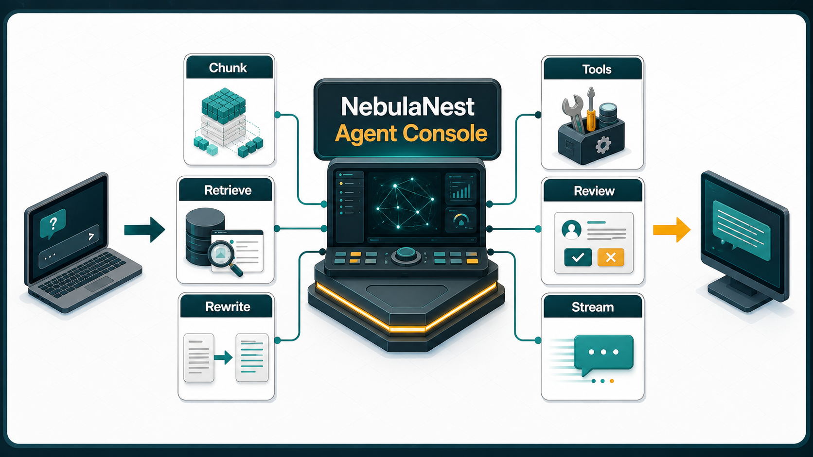
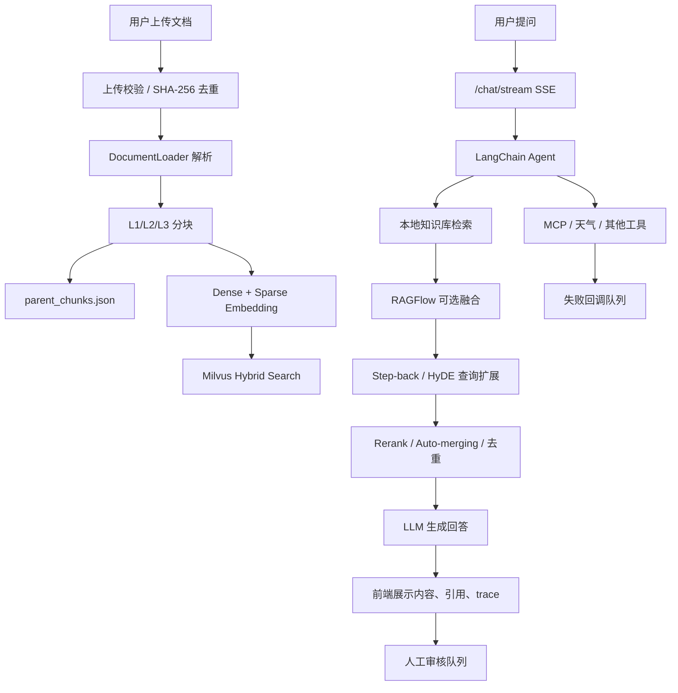

# NebulaNest Agent Console

NebulaNest（星巢智能体控制台）是一个本地运行的 Agent + RAG 工作台，正在向“可治理、可追踪、可评测”的企业级 AgentOps 平台演进。它把文档入库、混合检索、查询扩展、工具调用、失败回调和人工审核放在同一个控制台里，适合用于企业知识库问答、课程资料检索、客服辅助和智能体治理实验。



## 为什么做

普通 RAG Demo 往往只证明“能回答”，但企业场景更关心：

- 答案是否来自可追溯的文档片段。
- 工具调用失败后是否可发现、可重试、可审核。
- 文档入库是否幂等、安全、可回放。
- 检索质量和端到端延迟是否有指标支撑。
- 后续是否能接入权限、审计、异步任务和观测体系。

NebulaNest 的目标是把这些工程问题前置，而不是只继续堆更多模型和工具。

## 核心能力

| 能力 | 当前状态 | 说明 |
|---|---|---|
| 流式对话 | 已实现 | `/chat/stream` 通过 SSE 返回增量回答、RAG 步骤和最终 trace。 |
| 多格式入库 | 已实现 | 支持 PDF、Word、PPT、Excel、CSV、TXT。 |
| 入库治理 | 已实现雏形 | 上传文件做文件名安全校验、大小限制、SHA-256 去重，并记录本地 ingestion manifest。 |
| 分层 RAG | 已实现 | L3 叶子块进入 Milvus，L1/L2 父块进入本地 DocStore，检索后支持 auto-merging。 |
| 混合检索 | 已实现 | Dense embedding + BM25 sparse embedding + Milvus Hybrid Search，并使用 RRF 融合。 |
| 查询扩展 | 已实现 | 相关性不足时通过 LangGraph 触发 Step-back、HyDE 或组合策略补召回。 |
| Rerank | 可选 | 支持接入 SiliconFlow rerank。 |
| RAGFlow 融合 | 可选 | 外部召回结果可与本地 Milvus 结果融合去重。 |
| MCP/天气工具 | 已实现 | DashScope AMap MCP 与高德天气 REST API 独立配置。 |
| 失败回调 | 已实现 | 工具、RAGFlow、Milvus 等失败会进入 `data/tool_failures.json`，前端可处理。 |
| 人工审核 | 已实现 | 回答可提交审核队列，支持批准、驳回和修订。 |
| 工具策略引擎 | 已实现雏形 | 提供 tenant 校验、工具权限和高风险工具人工 gate 判定。 |
| CI/安全门禁 | 已实现雏形 | GitHub Actions 运行 lint、unit tests、Bandit、pip-audit。 |

## 设计亮点

### RAGFlow 风格的召回层

NebulaNest 的召回层借鉴了 RAGFlow 的工程化思路，但保留本地 Milvus 作为默认主链路：先用 Dense embedding + BM25 sparse embedding 做混合召回，再用 RRF 融合排序，并在相关性不足时触发 Step-back、HyDE 或组合式查询扩展。L3 叶子块负责精准命中，L1/L2 父块负责 auto-merging 上下文补全，最终结果会统一去重、可选 rerank，并把检索模式、评分路由、RAGFlow 命中情况写入 trace。

这套设计的优点是召回链路不会被单一向量检索锁死：短问题、抽象问题、关键词问题和跨段落问题都能走不同补偿策略；同时本地知识库和可选 RAGFlow 外部召回可以融合，既方便离线演示，也给后续接入企业级知识平台留下接口。

### Human-in-the-loop 审核闭环

NebulaNest 不把模型回答当作流程终点。前端可以把任意 Agent 回答提交到人工审核队列，审核员可批准、驳回或给出修订稿；工具、RAGFlow、本地检索失败也会进入失败回调队列，支持记录补偿动作、请求重试或关闭事件。

这个闭环让系统从“能回答”升级为“可治理”：高风险回答可以被人工兜底，失败事件不会静默丢失，审核状态和回调备注会保留在本地运行数据中，方便后续做质量复盘、标注沉淀和企业审计。

## 架构概览



当前版本仍以本地文件和 JSON 作为运行态存储，适合本地演示和工程验证。企业化路线建议迁移到 Postgres + 对象存储 + 队列 + OpenTelemetry，详见 [docs/enterprise-roadmap.md](docs/enterprise-roadmap.md)。

## 技术栈

- 后端：FastAPI、Uvicorn、Pydantic。
- Agent/RAG：LangChain、LangGraph、DashScope MCP。
- 向量库：Milvus standalone、MinIO、etcd。
- 检索：DashScope text embedding、BM25 sparse vector、Milvus Hybrid Search、RRF、可选 rerank。
- 文档解析：PyMuPDF、python-docx、python-pptx、pandas、openpyxl、xlrd。
- 前端：Vue 3 CDN、SSE、Marked、Highlight.js、Font Awesome。
- 质量门禁：pytest、ruff、Bandit、pip-audit、GitHub Actions。

## 目录结构

```text
backend/
  app.py                  FastAPI 应用入口
  api.py                  总路由聚合
  core/policy.py          工具策略引擎与人工 gate 判定
  services/               上传校验、入库任务、后续服务层
  routes_*.py             聊天、会话、文档、审核、回调路由
  agent.py                Agent 初始化和同步/流式对话
  mcp_service.py          DashScope AMap MCP 加载与工具封装
  settings.py             统一读取环境变量
  embedding.py            Dense embedding + BM25 sparse embedding
  milvus_client.py        Milvus 集合、查询、混合检索和自动重连
  rag_pipeline.py         LangGraph RAG 主流程
  rag_expanded.py         扩展查询后的多路召回节点
  retrieval_steps.py      Rerank、auto-merging、去重
  ragflow_client.py       可选 RAGFlow retrieval adapter
frontend/
  index.html              单页控制台
  script.js               Vue 挂载入口
  js/*.js                 前端状态、聊天、知识库、审核、格式化逻辑
  css/*.css               拆分后的样式模块
docs/
  enterprise-roadmap.md   企业化路线与压测计划
  assets/                 README 架构图资源
tests/
  test_*.py               后端单元测试与策略/入库回归测试
data/
  documents/              上传文件，本地运行数据，默认不提交
  ingestion_manifest.json 本地入库状态、版本、chunk 计数和重复内容记录
  parent_chunks.json      L1/L2 父块存储，默认不提交
  tool_failures.json      工具失败与回调记录，默认不提交
docker-compose.yml        Milvus、MinIO、etcd、Attu
```

## 快速启动

### 1. 准备环境

```powershell
uv sync
```

复制环境变量模板：

```powershell
Copy-Item .env.example .env
```

填入 `.env` 中的模型、embedding、Milvus 和可选工具配置。真实 Key 不要提交到仓库。

### 2. 启动 Milvus 依赖

```powershell
docker compose up -d
```

Attu 管理界面默认地址：

```text
http://127.0.0.1:8080
```

### 3. 启动应用

```powershell
uv run uvicorn backend.app:app --host 0.0.0.0 --port 8000
```

打开控制台：

```text
http://127.0.0.1:8000
```

## 环境变量

| 变量 | 用途 | 是否必需 |
|---|---|---|
| `CHAT_MODEL` | 主对话模型名 | 必需 |
| `CHAT_API_KEY` | 主对话模型与查询扩展访问 | 必需 |
| `CHAT_BASE_URL` | OpenAI-compatible Chat API Base URL | 必需 |
| `QUERY_EXPANSION_MODEL` | 查询扩展模型 | 建议配置 |
| `DASHSCOPE_MCP_API_KEY` | DashScope AMap MCP Key | 启用 MCP 时必需 |
| `AMAP_MCP_ENDPOINT` | DashScope AMap MCP Endpoint | 启用 MCP 时必需 |
| `DASHSCOPE_EMBEDDING_API_KEY` | 向量模型 Key | 文档入库/检索必需 |
| `DASHSCOPE_BASE_URL` | Embedding API Base URL | 文档入库/检索必需 |
| `DASHSCOPE_EMBEDDING_MODEL` | Embedding 模型名 | 文档入库/检索必需 |
| `RERANK_MODEL` | Rerank 模型名 | 启用 rerank 时必需 |
| `RERANK_BINDING_HOST` | Rerank 服务地址 | 启用 rerank 时必需 |
| `RERANK_API_KEY` | Rerank Key | 启用 rerank 时必需 |
| `AMAP_API_KEY` | 高德天气 REST API Key | 启用天气工具时必需 |
| `MILVUS_HOST` | Milvus 主机 | 本地知识库必需 |
| `MILVUS_PORT` | Milvus 端口 | 本地知识库必需 |
| `MILVUS_COLLECTION` | Milvus 集合名 | 本地知识库必需 |
| `MAX_UPLOAD_BYTES` | 单文件上传大小上限 | 默认 50MB |
| `RAGFLOW_ENABLED` | 是否启用 RAGFlow 融合 | 可选 |
| `RAGFLOW_BASE_URL` | RAGFlow 服务地址 | 启用 RAGFlow 时必需 |
| `RAGFLOW_API_KEY` | RAGFlow API Key | 启用 RAGFlow 时必需 |
| `RAGFLOW_DATASET_IDS` | RAGFlow 数据集 ID 列表 | 启用 RAGFlow 时必需 |

## 常用 API

| API | 方法 | 说明 |
|---|---|---|
| `/chat/stream` | POST | SSE 流式对话，返回内容、RAG 步骤和 trace。 |
| `/chat` | POST | 非流式对话。 |
| `/documents` | GET | 列出当前 Milvus 中的文档统计。 |
| `/documents/upload` | POST | 上传并入库文档，带安全校验与重复内容拦截。 |
| `/documents/{filename}` | DELETE | 删除指定文档的向量与父块记录。 |
| `/reviews` | GET/POST | 查看或创建人工审核项。 |
| `/reviews/{review_id}` | PATCH | 更新审核状态。 |
| `/tool-failures` | GET | 查看工具失败事件。 |
| `/tool-failures/{failure_id}` | PATCH | 更新失败事件状态或触发 MCP 重试。 |

## 质量门禁

安装开发依赖：

```powershell
uv sync --extra dev
```

本地检查：

```powershell
uv run --frozen ruff check backend tests
uv run --frozen pytest
uv run --frozen bandit -r backend
uv run --frozen pip-audit
```

GitHub Actions 会在 PR 上运行同一组基础检查。当前 ruff 配置先拦截真实错误和明显 bugbear 问题，历史长行等风格债务会在后续重构中逐步收敛。

## 后续路线

优先级建议：

1. 清理根目录：把实验脚本迁入 `experiments/`，补 `LICENSE`、`SECURITY.md`、`CONTRIBUTING.md`。
2. 元数据持久化：用 Postgres 替换核心 JSON 状态，文档、chunk、会话、审核、失败事件全部带 `tenant_id`。
3. 安全治理：接入 OIDC/JWT、RBAC、对象级权限、审计日志，把 `ToolPolicyEngine` 接入真实工具调用链。
4. 异步入库：上传只创建 job，解析、embedding、Milvus 写入交给 worker，支持重试和回压。
5. 可观测性：加入 OpenTelemetry、Prometheus/Grafana、结构化日志和工具调用 span。
6. 评测压测：建立 golden queries，记录 Recall@k、MRR、citation precision、TTFB、p95/p99。

压测计划、指标目标和评测数据结构见 [docs/enterprise-roadmap.md](docs/enterprise-roadmap.md)。

## 常见问题

### 前端仍提示 `amap_mcp_init`

如果终端显示 Agent 已启动但 MCP 未加载到工具，重点检查：

- `DASHSCOPE_MCP_API_KEY` 是否是开通 MCP 的 Key。
- `AMAP_MCP_ENDPOINT` 是否正确。
- 百炼控制台里的 AMap MCP 是否已开通，或是否需要重新开通升级协议。

### Milvus 报 `closed channel`

`milvus_client.py` 已支持自动重连并重试。若仍失败，检查 Milvus 容器健康状态：

```powershell
docker ps
```

后续生产化建议加入指数退避、熔断、健康探针和指标告警。

### 上传成功但搜索不到

检查：

- `DASHSCOPE_EMBEDDING_API_KEY` 是否有 embedding 额度。
- Milvus `19530` 是否可用。
- 上传文档是否生成 L3 叶子块。
- `MILVUS_COLLECTION` 是否与当前服务一致。
- `data/ingestion_manifest.json` 中该文档是否为 `ready`。

## 开发约定

- 不在业务代码中硬编码真实 Key，只通过 `.env` 或后续 Secret Manager 读取。
- 工具失败不要静默丢弃，统一记录到失败回调队列。
- 文档上传必须经过安全校验、大小限制和幂等判断。
- `data/`、`volumes/`、`.env`、`.venv/` 默认不提交，避免泄露运行数据和凭据。
- 新增治理能力时优先补测试，再接入 CI。
