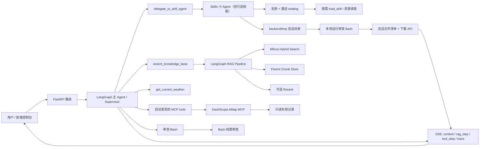

# Agent Console

Agent Console 是一个本地运行的 LangGraph 多 Agent + RAG 工作台。主 Agent 直接处理天气、知识库、审查 Bash 和启动时发现的 MCP 工具；专业流程、OpenCLI、PDF、代码审查和多步骤文件工作交给 Skills 小 Agent。控制台同时提供文档入库、混合检索、技能渐进加载、会话临时目录、浏览器自动化、工具步骤追踪和只读运行记录。

## 核心能力

- 流式对话：`/chat/stream` 通过 SSE 返回增量回答、RAG 步骤、工具调用步骤和最终 trace。
- Supervisor 委派：主 Agent 直接持有天气、知识库、审查 Bash 和启动发现的 MCP 工具，只通过 `delegate_to_skill_agent` 调用 Skills 小 Agent。
- 启动发现：MCP server 和 Skills 在应用启动时解析，结果保存到 `backend/config.json` 并在配置中心展示。
- 技能渐进披露：主 Agent 不看到技能 catalog；Skills 小 Agent 先看到受预算限制的名称/描述，选中后才加载完整 `SKILL.md` 和引用资源。
- 本地临时运行：Agent 生成的命令、脚本、程序、转换器和测试以当前会话的 `backend/tmp/<session-key>/` 为工作目录运行，中间产物也保存在这里。
- 会话文件下载：每个对话拥有独立文件目录，生成文件通过 SSE 进入回答卡片并可直接点击下载。
- 可视化工具流程：委派、小 Agent 的实际工具和 RAG 检索都会在前端展示调用参数、当前阶段和返回摘要。
- 本地知识库：支持上传 PDF、Word、PPT、Excel、CSV、TXT，解析后写入 Milvus。
- 分层 RAG：L1/L2 父块保存在本地 DocStore，L3 叶子块进入向量库，回答时支持 auto-merging 上卷上下文。
- 混合检索：BGE-M3 dense embedding + BM25 sparse embedding + Milvus Hybrid Search，并用 RRF 融合。
- 查询扩展：相关性不足时进入 LangGraph 节点，自动选择 Step-back、HyDE 或复杂组合策略。
- 可选重排：支持接入 SiliconFlow rerank。
- 地图与天气工具：DashScope AMap MCP 用于路线、POI、地址与坐标；高德 REST API 用于实时天气。
- OpenCLI 浏览器工具：可通过用户浏览器打开网页、读取页面状态、点击、输入、抽取内容和查看网络请求。
- 只读运行记录：MCP、OpenCLI、天气、Milvus 等失败会记录到 `data/tool_failures.json`；前端只能查看和刷新，不介入 Agent 流程。

## 技术栈

- 后端：FastAPI、Uvicorn、LangChain、LangGraph、Pydantic。
- Agent 工具：LangChain tools、langchain-mcp-adapters、DashScope MCP、OpenCLI。
- 向量库：Milvus standalone、MinIO、etcd。
- 检索：BGE-M3、Milvus Hybrid Search、BM25 sparse vector、RRF、可选 rerank。
- 文档解析：PyMuPDF、pypdf、python-docx、python-pptx、docx2txt。
- 前端：Vue 3 CDN、SSE、Marked、Highlight.js、Font Awesome。

## OpenCLI 在本项目中的定位

[OpenCLI](https://github.com/jackwener/OpenCLI) 是一个面向网站和浏览器自动化的 CLI 工具层。它可以把网站、已登录的 Chrome/Chromium 浏览器会话、Electron 应用和本地 CLI 包装成可调用接口，让人或 AI Agent 用稳定命令完成打开页面、读取 DOM、点击、输入、等待、抽取内容和查看网络请求等操作。

本项目没有把 1300+ 条 OpenCLI registry 命令逐个注入主 Agent，而是将 OpenCLI 的查询、浏览器、下载、网络、桌面应用等能力沉淀为 `agent_workspace/skills/opencli`，只交给 Skills 小 Agent：

- 主 Agent 需要访问网页、下载、查询或浏览器交互时，只委派完整任务；Skills 小 Agent 读取 live registry 和精确 help 后，再经审查 Bash 调用 `opencli`。
- OpenCLI 复用用户自己的浏览器登录态，适合查询 Bilibili 热门、网页列表、后台页面等需要真实浏览器上下文的任务。
- 工具执行失败会进入 `tool_failures.json` 和前端只读“运行回调”，不会让一次浏览器失败静默丢失。
- 每一次 OpenCLI 工具调用都会通过 SSE 展示在对话流程里，用户能看到调用参数、执行阶段和返回摘要。

## 架构流程



## 目录结构

```text
backend/
  app.py                  FastAPI 应用入口，挂载前端静态文件
  api.py                  总路由聚合
  config.json             MCP、Skills catalog、Bash 权限和发现结果
  config_service.py       config.json 原子读写与默认权限规则
  routes_config.py        MCP/Skills 增删、刷新和 Bash 审查 API
  routes_*.py             聊天、会话、文档、只读运行记录路由
  agent.py                主 Agent 初始化和同步/流式对话
  subagents.py            Skills 小 Agent 懒加载与统一委派入口
  agent_prompt.py         主 Agent 与各小 Agent 的系统提示词
  skill_service.py        技能元数据注册表、按名称加载和资源路径隔离
  workspace_tools.py      Skills 小 Agent 的受限文本工作区工具
  runtime_context.py      当前 user/session 上下文和隔离目录键
  local_runtime_service.py 在 backend/tmp 中运行命令、限制超时与输出
  artifact_service.py     会话产物枚举与安全下载路径解析
  routes_artifacts.py     产物列表和下载 API
  tools.py                本地天气、知识库检索和步骤事件队列
  tool_instrumentation.py 工具调用步骤包装器
  mcp_service.py          DashScope AMap MCP 加载与工具封装
  local_runtime_service.py 本地命令执行与会话临时目录环境
  settings.py             统一读取环境变量
  document_loader.py      文档解析和分层切块
  embedding.py            Dense embedding + BM25 sparse embedding
  milvus_client.py        Milvus 集合、查询、混合检索和自动重连
  parent_chunk_store.py   L1/L2 父块本地存储
  rag_utils.py            本地混合检索编排
  rag_pipeline.py         LangGraph RAG 主流程
  rag_expanded.py         扩展查询后的多路召回节点
  query_expansion.py      Step-back 与 HyDE
  retrieval_steps.py      Rerank、auto-merging、去重
frontend/
  index.html              单页控制台
  script.js               Vue 挂载入口
  js/*.js                 前端状态、聊天、知识库、运行记录、格式化逻辑
  style.css               样式入口
  css/*.css               拆分后的样式模块
agent_workspace/
  skills/                 迁移后的技能包和关联 resources/scripts
backend/tmp/
  <session-key>/          每个会话的中间产物和下载文件（Git 忽略）
data/
  documents/              上传文件，本地运行数据，默认不提交
  parent_chunks.json      L1/L2 父块存储，默认不提交
  tool_failures.json      工具失败与回调记录，默认不提交
docker-compose.yml        Milvus、MinIO、etcd、Attu 依赖服务
```

## 环境要求

- Python 3.12+
- Node.js >= 20，用于 OpenCLI CLI 和浏览器自动化
- uv
- Docker Desktop（仅 Milvus、MinIO、etcd 等数据服务需要）
- 可用的模型 API Key
- OpenCLI 和 Browser Bridge 扩展，用于访问用户自己的浏览器会话

安装依赖：

```powershell
uv sync
```

安装 OpenCLI：

Windows/macOS 本地使用也可以优先安装 OpenCLIApp，它会内置 OpenCLI runtime，并提供环境诊断、更新和浏览器登录态保活能力。纯 CLI、CI 或服务器环境可使用 npm 全局安装：

```powershell
node --version
npm install -g @jackwener/opencli
opencli doctor
```


启动 Milvus 依赖：

```powershell
docker compose up -d
```

查看容器状态：

```powershell
docker ps
```

## 环境变量

复制 `.env.example` 为 `.env`，再填入真实 Key。不要把真实 `.env` 提交到仓库。

```env
# Chat model
CHAT_MODEL=deepseek-v4-flash
CHAT_API_KEY=...
CHAT_BASE_URL=https://api.deepseek.com
QUERY_EXPANSION_MODEL=deepseek-v4-flash

# DashScope MCP (AMap/Gaode tools only)
DASHSCOPE_MCP_API_KEY=...
MCP_DISCOVERY_TIMEOUT=30
AMAP_MCP_ENDPOINT=https://dashscope.aliyuncs.com/api/v1/mcps/amap-maps/mcp

# BGE embeddings
EMBEDDING_MODEL=BAAI/bge-m3
EMBEDDING_DEVICE=cpu
EMBEDDING_DIM=1024
EMBEDDING_BATCH_SIZE=16
BM25_STATE_PATH=

# Rerank
RERANK_MODEL=BAAI/bge-reranker-v2-m3
RERANK_BINDING_HOST=https://api.siliconflow.cn/v1/rerank
RERANK_API_KEY=...

# AMap weather REST API
AMAP_WEATHER_API=https://restapi.amap.com/v3/weather/weatherInfo
AMAP_API_KEY=...

# Milvus
MILVUS_HOST=127.0.0.1
MILVUS_PORT=19530
MILVUS_COLLECTION=embeddings_bge_m3
MILVUS_DENSE_DIM=1024

# Optional OpenCLI browser automation
OPENCLI_BIN=
OPENCLI_SESSION=lcagent
OPENCLI_TIMEOUT=75
OPENCLI_OUTPUT_MAX_CHARS=12000

# Skills specialist and local tmp workspace
BACKEND_TMP_DIR=backend/tmp
AGENT_SKILLS_DIR=agent_workspace/skills
SKILL_CATALOG_MAX_CHARS=8000
SKILL_CONTENT_MAX_CHARS=60000
WORKSPACE_FILE_MAX_CHARS=50000
ARTIFACT_SIGNING_KEY=请替换为生产环境长随机值

# Local execution in backend/tmp
LOCAL_RUN_TIMEOUT=120
LOCAL_RUN_OUTPUT_MAX_CHARS=20000
LOCAL_RUN_COMMAND_MAX_CHARS=8000
```

### Key 职责

| 变量 | 用途 |
| --- | --- |
| `CHAT_API_KEY` | 主对话模型与查询扩展。 |
| `DASHSCOPE_MCP_API_KEY` | 高德地图 MCP，只用于 `mcp_service.py`。 |
| `MCP_DISCOVERY_TIMEOUT` | 单个 MCP server 的工具发现超时，默认 30 秒；超时会记录错误并继续启动。 |
| `RERANK_API_KEY` | 重排模型 Key，只用于 rerank。 |
| `EMBEDDING_*` | BGE embedding 配置，默认模型 `BAAI/bge-m3`，默认维度 `1024`。 |
| `BM25_STATE_PATH` | 可选，BM25 词表与 df 统计持久化路径；默认 `data/bm25_state.json`。 |
| `AMAP_API_KEY` | 高德天气 REST API，不等于 MCP Key。 |
| `OPENCLI_BIN` | 可选，显式指定 OpenCLI 可执行文件，例如 `C:\Users\wangy\AppData\Roaming\npm\opencli.cmd`。 |
| `OPENCLI_SESSION` | OpenCLI 浏览器会话名，默认 `lcagent`。 |
| `BACKEND_TMP_DIR` | Skills 小 Agent 的本地临时目录根，默认 `backend/tmp`。 |
| `AGENT_SKILLS_DIR` | `SKILL.md` 技能包根目录，默认 `agent_workspace/skills`。 |
| `SKILL_*_MAX_CHARS` | catalog 与单次完整技能内容的上下文预算。 |
| `WORKSPACE_FILE_MAX_CHARS` | 工作区文本文件单次读写上限。 |
| `ARTIFACT_SIGNING_KEY` | 文件下载 capability URL 的 HMAC 密钥；生产环境必须设置长随机值。 |
| `LOCAL_RUN_*` | 本地命令的超时、输出长度和命令长度限制。 |

## 启动应用

推荐在开发时显式使用 `PORT=8000`：

```powershell
$env:PORT="8000"
cd backend
..\.venv\Scripts\python.exe app.py
```

打开控制台：

```text
http://127.0.0.1:8000
```

常用本地服务：

| 服务 | 地址 |
| --- | --- |
| Agent Console | `http://127.0.0.1:8000` |
| Milvus gRPC | `127.0.0.1:19530` |
| Attu 管理界面 | `http://127.0.0.1:8083` |
| MinIO API | `http://127.0.0.1:9008` |
| MinIO Console | `http://127.0.0.1:9081` |

说明：`backend/app.py` 默认只监听 `127.0.0.1:8080`。为了避免和其他本地服务混淆，建议开发时显式设置 `PORT=8000`。配置 API 没有独立账号认证；若显式把 `HOST` 改为公网或局域网地址，必须在反向代理层增加认证和访问控制。

## 主要页面

- 对话：流式回答、主 Agent 委派、小 Agent 工具步骤、RAG trace 和引用片段。
- 知识库：上传文档、入库、查看文档块数量、删除文档。
- 运行回调：只读查看工具失败记录和调用参数；不提供重试、审批或状态修改。
- 历史会话：按用户和 session 读取历史消息。

## 主要 API

| 方法 | 路径 | 说明 |
| --- | --- | --- |
| `POST` | `/chat/stream` | SSE 流式对话，返回 `content`、`rag_step`、`tool_step`、`trace`。 |
| `POST` | `/chat` | 非流式对话。 |
| `GET` | `/sessions/{user_id}` | 获取用户会话列表。 |
| `GET` | `/sessions/{user_id}/{session_id}` | 获取会话消息。 |
| `POST` | `/documents/upload` | 上传文档并入库。 |
| `GET` | `/documents` | 查看已入库文档。 |
| `DELETE` | `/documents/{filename}` | 删除文档。 |
| `GET` | `/tool-failures` | 只读查看工具失败运行记录。 |
| `GET` | `/runtime-config` | 查看已解析的 MCP、Skills 和 Bash 权限配置。 |
| `POST` | `/runtime-config/refresh` | 重新扫描 Skills 并发现 MCP 工具。 |
| `POST` | `/runtime-config/mcp` | 添加或更新 MCP server，并立即发现工具。 |
| `DELETE` | `/runtime-config/mcp/{name}` | 删除 MCP server。 |
| `POST` | `/runtime-config/skills` | 用 `SKILL.md` 内容添加或更新 Skill。 |
| `DELETE` | `/runtime-config/skills/{name}` | 删除用户 Skill。 |
| `GET` | `/bash-audit` | 查看 Bash 自动审查决策。 |
| `GET` | `/sessions/{user_id}/{session_id}/artifacts` | 查看当前会话生成的文件。 |
| `GET` | `/sessions/{user_id}/{session_id}/artifacts/{path}` | 下载会话文件。 |

## 运行流程

### 1. 文档入库

用户在知识库页上传文件，后端先保存原始文件，再由 `DocumentLoader` 解析文本。解析结果会生成 L1/L2/L3 三层块：父块保存在 `parent_chunks.json`，叶子块生成 BGE dense embedding 和 BM25 sparse embedding 后写入 Milvus。BGE 模型和 Milvus client 都采用懒加载，应用启动时不会预加载向量模型。

### 2. 主 Agent 委派与按需工具选择

前端把问题提交到 `/chat/stream`，`agent.py` 调用 LangGraph 主 Agent。主 Agent 直接持有天气查询、知识库查询、自动审查 Bash 和启动时从 `backend/config.json` 发现的 MCP 工具；专业流程、OpenCLI、PDF、代码审查和多步骤文件工作则委派给 `delegate_to_skill_agent`。Skills 小 Agent 先看 catalog，再自行选择并加载一个或多个 Skill。委派和实际工具调用都会被 `tool_instrumentation.py` 包装成用户可见步骤。

### 3. RAG 检索与生成

知识库检索会先走 Milvus Hybrid Search：BGE dense 向量和 BM25 sparse 向量分别召回候选，再用 RRF 融合。候选返回后先做 auto-merging 上卷，再用可选 rerank 重新打分排序。如果没有搜到片段，或相关性评估不通过，LangGraph 才会触发查询改写，再用 Step-back、HyDE 或复杂查询策略补召回。最终检索结果会交给模型生成回答。

### 4. 运行记录

工具或外部服务失败会写入运行记录，避免静默失败。运行回调页面和 `GET /tool-failures` 只负责展示，不是审批节点，也不会重试或改变执行状态。

## Skills 加载与工作区

实现参考 [shareAI-lab/learn-claude-code](https://github.com/shareAI-lab/learn-claude-code) 的 s07 Skill Loading，并针对当前 supervisor 架构调整为由小 Agent 决策：

1. 主 Agent 只知道可以委派 `skills`，看不到具体技能名和正文。
2. Skills 小 Agent 创建时只注入 `name + description` catalog，默认最多 8000 字符。
3. 小 Agent 根据任务自行选择精确技能名，再调用 `load_skill` 读取完整 `SKILL.md`。
4. `references/`、`scripts/` 等资源必须通过 `read_skill_resource` 相对 skill root 读取，调用方不能传入任意技能路径。
5. 工作文件按 user/session 哈希分到 `backend/tmp/<session-key>/`；小 Agent 可列举、读取和显式写入文本。
6. 任何命令、脚本、生成程序、转换器和测试都调用经过审查的 `bash`，以对应会话目录为当前目录；源码、缓存、解压文件、预览、日志和最终文件全部留在这里。

7. 用户可以在前端“配置中心”增加 MCP server 和 Skill；保存后后端写入 `backend/config.json`、重新发现 MCP 工具并热加载主 Agent。

已从 `D:\learn_claude_code\skills` 原样迁移四个技能：`agent-builder`、`code-review`、`mcp-builder`、`pdf`，包括 `agent-builder` 的 references 和 scripts。新增技能时，在 `agent_workspace/skills/<name>/SKILL.md` 中提供 YAML frontmatter：

```yaml
---
name: example-skill
description: What the skill does and when the small agent should use it.
---
```

技能目录在进程内首次导入时建立注册表；新增或修改技能后重启服务即可刷新。完整技能正文不会进入主 Agent system prompt。

## 本地临时运行与文件下载

`bash` 先执行 s03_permission 风格的自动审查，再在宿主机运行单条命令，并把当前目录以及 `TMP`、`TEMP`、缓存目录都指向 `backend/tmp/<session-key>/`。未加引号的 `&`、`&&`、`|`、`;`、换行和命令替换会在创建进程前拒绝，避免白名单前缀被复合命令绕过。默认运行超时 120 秒，命令和输出长度受配置限制，常见 API key、token、password 环境变量不会传给子进程。它不是安全沙箱：允许的 Python/Node 等程序在操作系统权限上仍可能访问临时目录之外的路径，因此只适合受信任的本地使用环境。

stdio MCP 也会先经过相同的命令审查；内联解释器代码（`python -c`、`node -e`、`powershell -Command` 等）和会远程安装包的 `npx`/`npm` 形式会被拒绝。配置 API 只建议在本机使用，外部部署必须自行增加认证。

回答结束后，后端发送 `artifacts` SSE 事件；前端在对应 Agent 消息下显示文件名、路径、大小和下载按钮。下载 URL 带有服务端 HMAC capability token；删除会话时对应目录也会删除。若没有配置 `ARTIFACT_SIGNING_KEY`，首次运行会在 `backend/tmp/.artifact_signing_key` 生成本地密钥。历史消息会保存当时的文件清单。

当前项目没有账号登录系统。签名下载链接可防止仅凭 `user_id/session_id` 枚举文件，但正式公网多用户部署仍应在 FastAPI 前增加 SSO、反向代理认证或其他统一身份层，并限制 `/sessions` 与 `/tool-failures` 的访问。

MCP 由主 Agent 直接调用；OpenCLI 由 Skills 小 Agent 通过审查 Bash 调用。

## OpenCLI 浏览器自动化

OpenCLI skill 适合处理需要访问网页、读取当前页面、抽取热门内容、下载文件、分析网络请求或控制桌面应用的任务。它的工作方式是：Skills 小 Agent 先读取 live registry 和精确 help，再通过经过权限审查的 `bash` 调用本地 `opencli` CLI。本项目不把 OpenCLI 的 1300+ 个动态命令注册成主 Agent 工具。

OpenCLI skill 覆盖 live registry、公开查询、42 个 browser 命令、network、下载/导出、桌面应用、plugin/adapter/profile/daemon/external 管理面和 Node library exports。每次先运行 `opencli list -f json`，再读站点和具体命令的 `--help -f yaml`，避免把动态 registry 写死在提示词中。

典型浏览器顺序是打开或绑定 session、读取 `state`、使用返回的 refs 交互，再次读取 `state` 验证。下载、导出、截图和本地缓存全部写入当前 `backend/tmp/<session-key>/`。

建议手动验证环境：

```powershell
opencli doctor
```

官方常用命令示例：

```powershell
opencli list
opencli bilibili hot --limit 5
opencli browser lcagent open https://www.bilibili.com
opencli browser lcagent state
```

Windows 注意事项：

- npm 全局安装通常会生成 `opencli.cmd`。
- URL 中的 `&` 在 `cmd.exe` 中是命令分隔符，直接拼接命令会导致类似 `'pn' 不是内部或外部命令` 的错误。
- 通过 Bash 调用时必须给含 `&` 的 URL 加引号，避免 `cmd.exe` 把 URL 拆成多条命令。

安全边界：

- 登录、发布、发消息和浏览器交互等外部副作用需要小 Agent 显式声明“用户已在当前任务中要求该动作”，并写入 Bash audit；不新增阻塞式人工审核节点。
- 删除、归档、上传、任意 `eval`、自动批准、插件/外部 CLI 安装等 P4 操作由 Bash 执行层默认拒绝。
- 不绕过验证码、付费墙、权限控制或网站风控。
- 浏览器工具失败时，Agent 应说明限制，并避免用同一参数反复重试。

## 常见问题

### 启动时地图 MCP 显示发现失败

应用启动时会读取 `backend/config.json` 并发现启用的 MCP 工具；失败会把 server 和错误写入配置中心。重点检查：

- `DASHSCOPE_MCP_API_KEY` 是否是开通 MCP 的 Key。
- `AMAP_MCP_ENDPOINT` 是否正确。
- 百炼控制台里的 AMap MCP 是否已开通，或是否需要重新开通升级协议。

### OpenCLI 返回 `OPENCLI_ERROR`

先运行：

```powershell
opencli doctor
```

重点检查：

- OpenCLI daemon 是否运行。
- Browser Bridge 扩展是否安装并连接。
- `OPENCLI_BIN` 是否指向正确的可执行文件。
- 当前网页是否需要登录、验证码、权限确认或风控验证。

### Milvus 报 `closed channel`

`milvus_client.py` 已支持 `closed channel` 自动重连并重试一次。若仍失败，检查 Milvus 容器健康状态：

```powershell
docker ps
```

### 上传成功但搜索不到

检查：

- BGE 首次加载是否成功，必要时确认本机能下载 `BAAI/bge-m3` 或已缓存模型。
- Milvus `19530` 是否可用。
- 上传文档是否生成 L3 叶子块。
- `MILVUS_COLLECTION` 是否与当前服务一致。
- 如果从旧的 Jina 2048 维集合切到 BGE-M3，请使用新的集合名，例如 `embeddings_bge_m3`，并重新上传文档入库。

### 上传时报 `gbk codec can't encode`

这是 Windows 控制台编码导致的日志输出错误，常见于日志、文件名或文本中含有 emoji 等非 GBK 字符。项目已在 `encoding_utils.py` 中对 stdout/stderr 和上传日志做了保护；如果仍遇到类似问题，可设置：

```powershell
$env:PYTHONIOENCODING="utf-8"
```

### 前端收不到流式回答

检查：

- 后端是否启动成功。
- `/chat/stream` 是否返回 `text/event-stream`。
- 浏览器控制台是否有网络错误。
- 反向代理或浏览器插件是否缓存、压缩或缓冲 SSE。

## 开发约定

- 后端单文件尽量保持在 250 行以内。
- 前端 JS/CSS 已按功能拆分，`script.js` 和 `style.css` 只保留入口。
- 不要在业务代码中硬编码真实 Key，只通过 `.env` 读取。
- 工具失败不要静默丢弃，统一记录到 `tool_failures.json`；对外只开放读取接口。
- `data/`、`volumes/`、`.env`、`.venv/` 默认不提交，避免泄露运行数据和凭据。
- 手动改代码后至少运行：

```powershell
.\.venv\Scripts\python.exe -m compileall backend
node --check frontend\js\app-core.js
node --check frontend\js\chat.js
```
