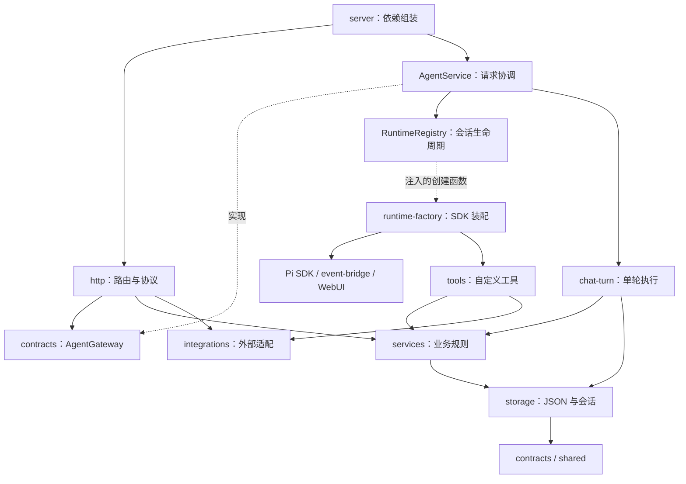

# 二狗子助手 · Pi 工作台

一个运行在本机的中文 Web Agent。你在网页中选定工作区、提出任务，Pi SDK 负责模型会话、工具调用和插件执行，生成的文件直接保存在所选目录。多步骤任务会展示并保存执行计划，意外中断后可以继续；工具或模型调用失败时会先分析原因，只对瞬时故障执行有上限的退避重试。项目还提供可选的本地文档知识库，适合一边处理项目文件，一边查询自己的资料。

开发者入口：[重构与验证记录](docs/refactoring.md) · [逐文件源码清单](docs/source-inventory.md) · [完整文件树](docs/file-tree.md)。运行 `npm run export:source` 可导出完整代码与校验清单。

**记忆统一由 `pi-memory` 插件管理。`backend/` 只负责知识库的文档解析、入库和检索，不运行第二套聊天 Agent 或记忆系统。**

## 目录

- [1. 功能与运行方式](#1-功能与运行方式)
- [2. 安装与首次启动](#2-安装与首次启动)
- [3. 网页使用流程](#3-网页使用流程)
- [4. Pi 记忆和插件](#4-pi-记忆和插件)
- [5. 项目架构与执行过程](#5-项目架构与执行过程)
- [6. 目录与源码阅读顺序](#6-目录与源码阅读顺序)
- [7. 数据保存与备份](#7-数据保存与备份)
- [8. 接口与运行命令](#8-接口与运行命令)
- [9. 测试和故障排查](#9-测试和故障排查)
- [10. 当前边界与扩展方式](#10-当前边界与扩展方式)

## 1. 功能与运行方式

| 能力                                     | 实现                                      | 是否需要 Python / Milvus     |
| ---------------------------------------- | ----------------------------------------- | ---------------------------- |
| 读取、修改项目文件，运行命令             | Pi 内置 `read/write/edit/bash` 等工具     | 否                           |
| 对话流式输出、停止任务、人机确认         | Node SSE + Pi 扩展 UI 适配                | 否                           |
| 多步骤计划展示、进度保存和断点续做       | `update_plan` + 会话 JSON 检查点          | 否                           |
| 工具/模型失败诊断和瞬时故障重试          | `retry-policy` + Pi 事件桥 + 前端重试状态 | 否                           |
| 文件交付和下载                           | 工作区真实文件 + `deliver_files`          | 否                           |
| 会话历史                                 | 宿主的 JSON 会话存储                      | 否                           |
| 长期记忆、日记、待办                     | `pi-memory` 插件                          | 否                           |
| 网页资料、子 Agent、代码诊断、上下文管理 | Pi 社区插件                               | 否；部分插件有自己的外部依赖 |
| 图片问答                                 | 主模型或 `@getpipher/vision` 适配         | 否；需要可用的视觉模型       |
| 上传资料、文档问答和来源查看             | Python 知识库 + Milvus                    | 是                           |
| 创建、上传和加载 Skill                   | 宿主 Skill 服务 + Pi 资源加载器           | 否                           |

有两种启动方式：

- **只使用 Agent**：启动 Node 即可。文件操作、Pi 记忆、Skills 和插件不依赖知识库侧车。
- **使用完整知识库**：额外启动 Python 服务和 Docker 中的 Milvus 组件。只有检索和文档管理需要这部分。

## 2. 安装与首次启动

以下 PowerShell 命令均在项目根目录执行。不要从 `backend/` 或任务工作区内启动宿主：Node 使用启动目录定位前端、配置和 `tmp/`。

### 2.1 环境准备

| 环境                                   | 用途                                                 |
| -------------------------------------- | ---------------------------------------------------- |
| Node.js 22.19+，可使用 24 LTS          | 运行 TypeScript 宿主、Pi SDK 和插件                  |
| npm                                    | 根据 `package-lock.json` 安装 Node 依赖              |
| Git for Windows                        | 提供 Git 和 Pi 内置命令工具使用的 Git Bash           |
| 可用的模型 API 密钥                    | 主模型对话与工具调用                                 |
| Python 3.12+、uv（知识库模式）         | 安装和运行 Python 侧车；当前本机环境使用 Python 3.12 |
| Docker Desktop + Compose（知识库模式） | 运行 Milvus、etcd、MinIO，Attu 用于可视化管理        |

先确认安装的程序可在终端中找到：

```powershell
node --version
npm --version
git --version
# 使用知识库时再检查下面三项
uv --version
python --version
docker compose version
```

BGE 模型和 Python 向量计算依赖占用较多磁盘及内存。初次使用知识库需要下载模型；下载完成后可以从本地缓存加载。

### 2.2 配置模型

```powershell
# 仅在文件不存在时复制，保留已有密钥和配置。
if (-not (Test-Path .env)) { Copy-Item .env.example .env }
```

编辑根目录 `.env`：

```dotenv
CHAT_API_KEY=填写你的模型服务密钥
CHAT_MODEL=deepseek-chat
EMBEDDING_LOCAL_FILES_ONLY=false
```

`CHAT_MODEL` 必须填写账户实际可用且支持工具调用的模型 ID。宿主的默认接口为 `https://api.deepseek.com`，可用 `CHAT_BASE_URL` 覆盖。Node 通过 OpenAI 兼容协议访问模型；Python 的相关性评估和查询扩展使用 DeepSeek 适配器，其他供应商的兼容性需要单独验证。

知识库还有 `GRADE_MODEL`（默认 `deepseek-v4-flash`）和 `QUERY_EXPANSION_MODEL`（默认跟随 Python 的 `CHAT_MODEL`）。如果账户没有默认评估模型，请在 `.env` 中显式设置 `GRADE_MODEL`。配置清单及默认值见 [配置说明](docs/configuration.md)。

### 2.3 只启动 Agent

```powershell
npm ci --ignore-scripts
npm start
```

打开 [http://127.0.0.1:3000](http://127.0.0.1:3000)。不需要先运行 Python、下载 BGE 或启动 Docker。

`--ignore-scripts` 跳过依赖的安装生命周期脚本；宿主直接加载已安装的 Pi 包资源。需要 qmd 等可选工具时另行安装，见下文记忆说明。

### 2.4 启动完整知识库

在已安装 Node 依赖并配置 `.env` 的基础上：

```powershell
uv sync --locked
# 先打开 Docker Desktop，等待 Docker 引擎就绪。
docker compose up -d
docker compose ps
# 首次可单独下载并验证嵌入模型。
uv run python -m backend.preload_embedding_model
# 同时启动 Node 和 Python。
npm run dev
```

不要与已经运行的 `npm start` 占用同一个端口。先在原终端按 `Ctrl+C`，再运行 `npm run dev`。

`npm run dev` 同时启动两个进程：Node 使用 `tsx watch`，Python 使用 Uvicorn。**当前 Python 命令没有 `--reload`**，修改 Python 代码后需要重启。关闭这组开发进程可按 `Ctrl+C`。

模型下载完成后，可在 `.env` 中设置 `EMBEDDING_LOCAL_FILES_ONLY=true`，以后启动只从本地缓存加载。不要在首次下载前开启这一选项。

### 2.5 确认服务状态

```powershell
Invoke-RestMethod http://127.0.0.1:3000/health
Invoke-RestMethod http://127.0.0.1:8091/health
docker compose ps
```

- Node 返回 `ok: true` 表示 Web 已运行；`rag: true` 表示 Python 健康接口可访问。
- 只运行 Agent 时，`rag: false` 是预期状态。
- Python 在启动阶段加载 BGE 并检查维度，通过后才开始接收请求。
- `rag: true` **不代表 Milvus 或外部模型接口已通过连接测试**。进入“知识库”读取文档列表可检查数据库连接；上传一个短 TXT 并提问可检查完整链路。

| 默认地址 / 端口           | 服务                                           |
| ------------------------- | ---------------------------------------------- |
| `127.0.0.1:3000`          | Node Web 工作台                                |
| `127.0.0.1:8091`          | Python 知识库 API；交互式 API 文档位于 `/docs` |
| `127.0.0.1:19530`         | Milvus                                         |
| `127.0.0.1:9091`          | Milvus 健康检查端口                            |
| `127.0.0.1:8083`          | Attu 管理页面                                  |
| `127.0.0.1:9081` / `9008` | MinIO 控制台 / API                             |

Compose 只管理数据库相关组件，不会启动 Node 或 Python。可用 `docker compose stop` 停止数据库服务并保留数据。

## 3. 网页使用流程

### 3.1 选择工作区并执行任务

1. 打开“对话”，在顶部输入现有文件夹的绝对路径并点击“应用”，或在 Windows 上点击“选择文件夹”。例如 `D:\ts_test`。
2. 核对“当前工作区”。新用户默认目录是项目根；保存的目录失效时也会回退到项目根，因此开始任务前要确认路径。
3. 输入具体任务，例如：

   ```text
   检查这个目录里的 TypeScript 练习，补充 tsconfig.json 和运行脚本，实际运行验证后告诉我结果。
   ```

4. 回复会实时显示文字和工具活动。需要你选择或输入时，在弹出的对话框中完成交互。
5. 多步骤任务会在工作区栏下方显示完整执行计划、当前步骤和完成比例；每完成一步，页面会立即更新。
6. 任务完成后，在工作区检查修改；已登记的文件也会出现在回复的交付列表中，可下载。

`read/write/edit/bash` 使用选定目录作为实际 `cwd`。切换工作区会销毁该用户已有 Runtime，并在网页开始新会话。运行中的任务必须先完成或停止。

停止任务会取消当前请求和待处理的交互框，**不会撤销已经写入的文件或执行完成的命令**。代码类任务建议在 Git 仓库中进行，便于检查修改。

### 3.2 查看历史和文件成果

- “历史”列出当前浏览器用户 ID 对应的会话。打开历史时会恢复对应的工作区和已保存消息。
- 未完成计划会在历史中标为“计划可续”。停止、断网或进程重启后，重新打开同一会话并发送“继续”，或点击计划卡的“继续执行”，会从保存的未完成步骤接着做。
- “新会话”创建新的会话 ID；“清空当前”目前只清空网页显示的消息，不等于删除服务端历史，也不会清除 Pi 记忆。
- 历史抽屉目前提供会话列表与打开功能；服务端另有删除历史的 `DELETE /sessions/:userId/:sessionId` 接口，删除记录不会删除工作区文件。
- `write/edit` 成功后宿主会尝试登记文件。通过 Shell 创建的成果需要 Agent 调用 `deliver_files` 登记。
- 下载只允许该会话登记过、仍存在于原工作区中的文件。文件被移走或删除后，历史下载链接可能失效。

### 3.3 失败诊断和自动重试

工具调用失败后，错误和“宿主失败诊断”会先作为工具结果返回 Agent。Agent 必须先判断是否应该修改参数、路径、权限或执行指令；只有确认属于瞬时故障时，才会再次发起相同工具调用。宿主以“工具名 + 规范化参数”识别相同调用，并在真正执行前等待。

模型连接失败时，Pi 先判断错误是否可重试。宿主会移除失败的助手消息，把错误原因作为恢复上下文交给下一次模型调用，要求它从中断处继续，避免重复已经完成的文件写入、命令或计划步骤。底层供应商的嵌套自动重试已关闭，由宿主统一控制节奏和前端状态。

| 情况                                                          | 行为                                                               |
| ------------------------------------------------------------- | ------------------------------------------------------------------ |
| 网络断开、连接重置、超时、限流、服务过载、HTTP 5xx 等瞬时故障 | 允许重试；间隔依次为 1、2、4、8 秒，每次再增加 `[0, 1)` 秒随机抖动 |
| 参数无效、路径/权限错误、认证失败、配额或账单问题、功能不支持 | 不原样重试；将原因交给 Agent 修改调用或方案                        |
| 同一工具和参数连续失败                                        | 最多重试 4 次；第 4 次仍失败就停止并要求调整方案                   |
| 用户点击停止                                                  | 取消正在进行的模型请求、工具流程或退避等待；已产生的副作用不会回滚 |

对话中的状态卡会显示“正在分析失败原因”“稍后重试”“重试成功”或“重试次数已用完”，以及当前次数和预计等待时间。模型或工具最终仍失败时，页面才显示最终错误。

### 3.4 上传资料并进行知识库问答

1. 按完整知识库方式启动服务。
2. 打开“知识库”，选择文档并上传，等待“解析并写入知识库”完成。
3. 返回“对话”，明确提出与上传文件有关的问题，例如：

   ```text
   根据刚上传的项目说明，列出部署步骤，并注明引用的文件和页码。
   ```

4. Agent 调用 `search_knowledge_base`，取得来源片段后组织回答。回复中的来源区域可查看文件名、页码和检索片段。

单文件上限为 **50MB**。文档按文件名识别，同名上传会替换对应的索引。解析使用暂存文件，解析失败不会覆盖原文件；索引写入阶段并非完整数据库事务，失败时应检查状态后重新上传。

| 格式             | 处理方式 / 注意事项                                                                     |
| ---------------- | --------------------------------------------------------------------------------------- |
| `.txt`           | 读取 UTF-8 文本                                                                         |
| `.pdf`           | 提取文字、按页分块；内嵌图片描述需要可选的 `DASHSCOPE_API_KEY`                          |
| `.docx`          | 读取段落和表格；来源页码通常为逻辑页 1，不做 Word 渲染分页                              |
| `.doc`           | 优先尝试 Microsoft Word，再尝试 LibreOffice、antiword；至少有一种可用，或先转成 `.docx` |
| `.pptx`          | 按幻灯片提取文字，可选择识别内嵌图片                                                    |
| `.xlsx` / `.xls` | 读取表格；当前默认读取第一个工作表                                                      |
| `.csv`           | 使用 pandas 读取表格文本                                                                |

旧版二进制 `.ppt` 请先另存为 `.pptx`。目前没有可用的 `.ppt` 转换器，因此已移除原来会在解析时失败的上传入口。

知识库删除按钮移除该文件的检索索引并回退相关统计，保存的源文档与提取图片仍可能留在 `tmp/knowledge/`。知识库是项目级共享数据，不会因切换任务工作区自动切换。

### 3.5 图片和 Skills

聊天输入框的图片按钮支持每条消息最多 **5 张 PNG/JPEG/WebP/GIF**。聊天图片属于当前任务附件，不会自动进入知识库。主模型能否直接接收图片由 `CHAT_MODEL_SUPPORTS_IMAGES` 控制；`describe_image` 使用视觉适配器，需要供应商支持的 `VISION_MODEL`。

打开“配置中心”可以查看已选插件、加载错误、权限摘要，以及创建、上传、删除用户 Skill。该页面主要用于资源查看和 Skill 管理；模型密钥与高级参数仍在 `.env` 中配置。

上传一个 `SKILL.md`，或包含一个 Skill 的 ZIP。格式示例：

```markdown
---
name: project-review
description: 检查当前工作区的代码结构并输出审查报告。
---

# Workflow

1. 阅读项目说明与入口文件。
2. 检查模块依赖和错误处理。
3. 将报告写到工作区的 review.md，并登记交付文件。
```

名称只允许小写字母、数字和连字符。上传上限 10MB；ZIP 解压上限 30MB / 200 个文件。覆盖前会校验路径、符号链接、重复文件和内容，校验失败不覆盖旧 Skill。保存后在下一轮任务开始时热加载，不打断正在执行的任务。

## 4. Pi 记忆和插件

### 4.1 如何使用记忆

`pi-memory` 随项目 Node 依赖安装，由资源加载器注册。宿主在启动时将 `PI_MEMORY_DIR` 固定为项目的 `tmp/pi-memory`，不需要 Python、mem0、Qdrant 或 Milvus。

直接在对话中提出记忆需求，例如：

```text
请记住：我希望 TypeScript 项目启用 strict，并优先使用中文解释。保存到长期记忆。
读取当前长期记忆，告诉我已经记录了哪些偏好。
检查记忆服务状态和存储位置。
```

对应的插件工具包括：

| 工具                               | 用途                                        |
| ---------------------------------- | ------------------------------------------- |
| `memory_write`                     | 写入长期记忆或每日日志                      |
| `memory_read`                      | 读取记忆文件、列出每日日志                  |
| `memory_status`                    | 检查路径、配置、qmd 和索引状态              |
| `memory_forget` / `memory_restore` | 删除匹配条目并生成恢复记录 / 按恢复 ID 恢复 |
| `scratchpad`                       | 管理待办清单                                |
| `memory_search`                    | 通过 qmd 搜索记忆                           |

应以工具返回的保存结果为准；普通回复说“记住了”并不等于文件已持久化。插件按自己的策略注入记忆上下文。默认 `stable` 模式在会话开始、长期记忆写入后的下一轮等检查点刷新；每日日志和待办的最新状态可以主动调用 `memory_read` 查看。

`memory_search` 的关键词、语义和深度搜索都依赖 **qmd**。没有 qmd 时，记忆读写、待办和状态查询仍可使用。需要搜索时可根据已安装插件的说明单独安装：

```powershell
npm install -g @tobilu/qmd
qmd --version
```

安装后重启 Node，让插件识别新命令；索引和向量准备状态可通过 `memory_status` 查看。相关插件配置见 [配置说明](docs/configuration.md#pi-memory)。

### 4.2 三种数据不要混淆

| 数据       | 保存位置                         | 用途                                             |
| ---------- | -------------------------------- | ------------------------------------------------ |
| 会话历史   | `tmp/sessions/`                  | 恢复消息、来源、图片引用、交付物和计划步骤检查点 |
| Pi 记忆    | `tmp/pi-memory/`                 | 跨会话的偏好、事实、日记和待办                   |
| 文档知识库 | `tmp/knowledge/` + Milvus 数据卷 | 对用户上传的资料进行检索                         |

Pi 记忆目录目前在本项目内共享，不按浏览器用户 ID 或工作区隔离。新会话、切换工作区和删除会话历史都不会自动清空记忆。

旧的 mem0 API、网页管理面板、Python 实现和专属依赖已移除。原有 `tmp/mem0/` 若存在，只是保留的历史数据，不会自动导入 Pi 记忆，也不再被应用使用。

### 4.3 已配置的 Pi 包

实际版本锁定在 `package.json` / `package-lock.json`，加载清单在 `src/integrations/pi/plugin-resources.ts`。

| 功能           | Package                                              | 宿主适配                                           |
| -------------- | ---------------------------------------------------- | -------------------------------------------------- |
| Agent 核心     | `@earendil-works/pi-coding-agent`，当前锁定 `0.84.4` | 创建和恢复模型会话，注册工具，订阅事件             |
| 上下文管理     | `@hypabolic/pi-hypa`                                 | 宿主配置独立缓存；SDK 自身也启用上下文压缩         |
| 网页与外部资料 | `pi-web-access`                                      | 配置 Exa / DuckDuckGo 路由，不自动打开浏览器       |
| 子 Agent       | `pi-subagents`                                       | 配置独立的子会话和临时成果目录                     |
| 人机确认       | `@juicesharp/rpiv-ask-user-question`                 | 通过 WebUI 将选择和输入转为网页交互                |
| 代码质量       | `pi-lens`                                            | 保留诊断；关闭自动安装检查器、自动格式化和自动修复 |
| 权限与审计     | `@gotgenes/pi-permission-system`                     | 工作区、附件、Skill 资源和敏感文件规则             |
| 长期记忆       | `pi-memory`                                          | 独立 Markdown 记忆目录                             |
| 图片识别       | `@getpipher/vision`                                  | 使用公开委派 API，避免直接加载不兼容的终端 UI 扩展 |

插件安装成功不代表它依赖的外部模型、网络或命令已经可用。加载错误可在“配置中心”查看，工具执行错误显示在当前对话中。

## 5. 项目架构与执行过程

### 5.1 总体结构

```text
浏览器：Vue 3 工作台
   │ HTTP / SSE（同源请求）
   ▼
Node：Express + Pi SDK                         :3000
   ├─ 工作区、文件交付、上传、Skills、历史
   ├─ AgentService → Pi 模型会话 → 工具 / 插件
   │                              ├─ 项目文件与命令
   │                              ├─ pi-memory → tmp/pi-memory
   │                              └─ 网页 / 视觉 / 诊断等
   └─ search_knowledge_base / 文档代理
                 │ HTTP
                 ▼
Python：FastAPI 知识库侧车                     :8091
   ├─ 文档解析 → 三级分块 → BGE dense + BM25 sparse
   ├─ 父块 JSON / BM25 统计 / 源文档
   └─ LangGraph 检索流程
        ├─ Milvus 混合召回 + RRF               :19530
        ├─ Auto-merge + 可选 rerank
        ├─ 相关性评估 / 必要时扩展查询
        └─ 来源片段与检索轨迹 → Pi 生成最终回答
```

当前架构是 **Node 模块化宿主 + 可选 Python 知识库侧车**。浏览器负责交互与展示，Node 负责对话、工具调度和本地业务，Python 负责文档解析与检索。Node 内部按职责分层，仍在一个进程中运行；Compose 管理的 Milvus、MinIO、etcd 是知识库存储基础设施。

Python 保留 LangChain / LangGraph，是因为它们仍用于文档切分、嵌入模型适配和检索流程。这里的模型调用只做文档相关性评估、查询扩展及可选文档图片描述，最终对话和工具决策由 Pi 完成。主模型、视觉、检索评估和查询扩展各有配置入口；它们的调用位置和用途不同，不能仅凭其中一个接口成功就判断其他能力可用。

### 5.2 Node 模块职责与依赖方向

| 模块               | 核心文件 / 接口                                                                                          | 职责与边界                                                                               |
| ------------------ | -------------------------------------------------------------------------------------------------------- | ---------------------------------------------------------------------------------------- |
| 启动与组装         | `main.ts`、`server.ts`、`bootstrap/`                                                                     | 加载环境、配置代理和缓存，再生成运行配置、组装服务并监听端口                             |
| 配置               | `config/paths.ts`、`models.ts`、各配置构建器、`runtime-layout.ts`                                        | 分离路径常量、环境参数、配置对象构建与磁盘写入，避免读取一个路径就触发配置写入           |
| 公共契约           | `contracts/chat.ts`、`sessions.ts`、`artifacts.ts`、`uploads.ts`                                         | 定义 `AgentGateway`、聊天参数、会话记录和上传/交付数据结构，不依赖 Express 或 Pi         |
| HTTP 适配          | `http/app.ts`、`routes/`、`sse.ts`、`errors.ts`                                                          | 路由组装、参数解析、SSE 编码与错误响应；通过 `AgentGateway` 使用 Agent 能力              |
| Agent 编排         | `agent/agent-service.ts`、`runtime-registry.ts`、`runtime-factory.ts`、`chat-turn.ts`、`retry-policy.ts` | 分别管理请求、Runtime 生命周期、SDK 装配、单轮执行和失败恢复                             |
| 业务服务           | `services/`、`services/skills/`                                                                          | 工作区、上传、交付文件以及 Skill 校验/安装规则；不引用 HTTP 或 Agent 实现                |
| 持久化             | `storage/json-store.ts`、`session-store.ts`                                                              | JSON 文件读写、进程内按文件互斥、会话追加与查询；数据类型来自 `contracts/`               |
| Agent 工具         | `tools/knowledge-tool.ts`、`vision-tool.ts`、`delivery-tool.ts`、`plan-tool.ts`                          | 将知识库、视觉、交付和计划能力注册为 Pi 工具，保留各自名称与参数契约                     |
| 外部适配与公共基础 | `integrations/`、`shared/`                                                                               | 前者封装 Pi 资源发现、视觉兼容、RAG HTTP 和 Windows 目录选择；后者提供通用错误及 ID 校验 |

下面展示主要依赖关系；虚线表示接口实现或工厂注入。完整文件级依赖见 [TypeScript 依赖图](docs/dependencies.mmd)。



依赖约束由 `tests/architecture.test.ts` 检查：HTTP 不直接导入 `agent/`；业务和存储层不依赖 Express、Multer 或 Pi；存储不反向依赖业务服务；`contracts/` 与 `shared/` 仅能依赖这两个基础目录。检查覆盖类型导入、再导出和字面量动态导入，确保本地相对导入可解析且无循环。`config/index.ts`、`http/shared.ts` 和原服务导出保留兼容入口，内部实现优先引用具体模块。

### 5.3 启动顺序与 Runtime 生命周期

启动顺序为 `main.ts → bootstrap → 动态导入 server.ts → ensureRuntimeLayout → createApplication → listen`。插件可能在模块导入时读取环境变量，因此 `main.ts` 必须先完成代理和环境配置，再导入服务。`runtime-layout.ts` 负责准备目录并写入模型、权限、视觉及插件运行配置；HTTP 应用由 `server.ts` 注入 `AgentService`。

一个 Runtime 以用户 ID 和会话 ID 定位，包含工作区、Pi session、WebUI、事件出口、交付文件集合和 Skill 重载标记。它在收到聊天请求时按需创建，与磁盘上的会话历史分开管理。

| 环节       | 实现与行为                                                                                                                                                                                                                                            |
| ---------- | ----------------------------------------------------------------------------------------------------------------------------------------------------------------------------------------------------------------------------------------------------- |
| 请求占用   | `AgentService` 在第一次异步初始化前登记请求，同一用户/会话不能同时执行两轮；退出时释放占用                                                                                                                                                            |
| 复用与重建 | `RuntimeRegistry` 复用工作区相同的就绪 Runtime；工作区不同时销毁旧实例后重建                                                                                                                                                                          |
| 初始化     | `runtime-factory.ts` 装配模型、资源加载器、Pi 内置工具和自定义工具，恢复历史与计划，订阅事件并绑定 WebUI                                                                                                                                              |
| 初始化交互 | 初始化中的实例有独立的交互/取消通道，插件绑定期间提出的问题也可以回答；只有绑定成功才进入就绪缓存，失败会清理已创建的 session                                                                                                                         |
| 失败恢复   | 工具错误先作为诊断结果返回 Agent，由 Agent 决定修改参数/指令或再次调用；只有网络、限流、超时和 5xx 等瞬时故障允许相同调用重试。模型连接故障也会把原因注入恢复上下文。两类重试统一使用 1、2、4、8 秒加 0–1 秒随机抖动，最多 4 次，并通过前端状态卡展示 |
| Skill 更新 | 更新资源后将 Runtime 标为待重载，在下一轮开始时调用 `session.reload()`；失败保留标记，下一轮可重试                                                                                                                                                    |
| 停止与切换 | 连接关闭触发 `AbortSignal`，取消模型执行和待处理交互；初始化、重载或附件准备后也会检查取消状态。工作区路由拒绝在该用户仍有任务时切换                                                                                                                  |

资源加载器读取项目内置 `.pi/skills/`、沿用的 `agent_workspace/skills/` 和网页管理的 `tmp/user-skills/`，并加载选定插件。实际文件操作的 `cwd` 来自用户选择的工作区。Pi session 使用内存会话管理，宿主通过自己的 JSON 存储恢复用户/助手文本及历史图片路径，不持久化完整 SDK 会话状态。

### 5.4 一轮对话的数据流与异常处理

1. `frontend/js/chat.js` 提交 `/chat/stream`，携带用户 ID、会话 ID、消息和可选图片。路由建立 SSE、校验输入、读取工作区并保存附件，再通过 `AgentGateway.chat()` 交给 Agent。
2. `AgentService` 获取 Runtime；`chat-turn.ts` 按需重载 Skills，重置本轮文件集合和知识库调用计数，由 `prompt-images.ts` 准备图片及提示词。支持图片的主模型直接接收图片，否则提示 Agent 使用 `describe_image`。
3. 用户消息先追加到 `session-store.ts`，然后调用 Pi `session.prompt()`。Pi 决定何时回复、调用工具或通过插件请求交互。
4. `event-bridge.ts` 将 SDK 文字增量转换成 `content`，将工具开始/结束转换成 `tool_step`；`retry-policy.ts` 把失败诊断交回 Agent，并只为瞬时故障安排带抖动的指数退避；`update_plan` 每次提交完整计划并立即落盘，再发送 `plan` 事件；知识库工具输出来源轨迹，WebUI 输出交互事件。前端增量解码并更新对应消息。
5. `write/edit` 成功后记录候选路径，`collect-artifacts.ts` 在轮次结束时重新校验文件；`deliver_files` 可显式登记其他工具生成的成果。下载时还会检查会话登记记录、文件真实路径和工作区边界。
6. `chat-turn.ts` 保存助手文本、检索来源、交付信息和最新计划快照；未完成计划在轮次结束时标记为可继续。路由在正常返回后发送 `[DONE]` 并结束连接。轮次退出时解除事件出口，路由清理心跳，服务释放请求占用。

| 通道              | 关键协议                                                                                                                             |
| ----------------- | ------------------------------------------------------------------------------------------------------------------------------------ |
| 回复与工具状态    | `content`、`tool_step`、`plan`、`retry`、`trace`、`artifacts` 等 SSE 数据事件；15 秒发送一次注释心跳                                 |
| 用户交互          | `ui_request` 打开交互框，`POST /chat/ui-response` 回传答案，`ui_closed` 关闭；无效或过期回答返回 410                                 |
| 普通 HTTP 错误    | `shared/errors.ts` 提供错误消息与 `AppError` 状态码，`http/errors.ts` 统一输出 `{ "detail": "..." }`，保留路由及解析器的错误状态语义 |
| 已建立的 SSE 错误 | 路由捕获异常后发送 `type: "error"` 并关闭连接，不追加正常完成标记；请求解析/上传阶段的异常仍走 HTTP 错误响应                         |

可恢复的模型错误不会立即发送最终错误事件；`event-bridge.ts` 先发送 `retry` 状态，重试成功后继续当前轮，达到上限或遇到确定性错误时才发送最终错误。最终失败后，单轮执行仍会尝试保存已生成的部分回复、计划检查点和交付记录，再向路由抛出异常；这依赖后续文件校验及存储成功。取消任务不会回滚已经发生的文件写入或命令副作用。

### 5.5 前端模块与状态流

前端采用 Vue 3 全局脚本模式，无独立构建步骤。`index.html` 按顺序加载脚本，各功能通过 `Object.assign(window.NebulaNestApp.methods, ...)` 组装方法，最后由 `script.js` 挂载。脚本顺序和共享状态字段是当前明确保留的耦合点。

| 文件                                                         | 职责                                                                     |
| ------------------------------------------------------------ | ------------------------------------------------------------------------ |
| `app-core.js`                                                | 共享状态、计算属性及浏览器保存状态的恢复                                 |
| `chat.js`                                                    | 发消息、创建本轮消息状态、停止请求                                       |
| `chat-stream.js`                                             | UTF-8 增量解码、SSE 缓冲和事件分发，更新回复、计划、重试、工具及交付状态 |
| `chat-messages.js`                                           | 回复分段、来源合并、工具活动滚动及交互答案提交                           |
| `history.js`                                                 | 会话列表、打开历史及工作区恢复                                           |
| `workspace.js`、`knowledge.js`、`config.js`、`formatters.js` | 工作区、文档管理、运行配置/Skills 和展示格式化                           |

主要更新链路为“浏览器输入 → HTTP/SSE → 消息状态 → Vue 渲染”，用户交互通过独立 HTTP 请求回传。旧计划和旧检索事件的展示兼容代码仍保留，用于历史数据及旧事件格式；当前对话执行入口仍是 Pi Runtime。

### 5.6 知识库入库和检索

**入库**：上传文件 → 校验格式和大小 → 暂存解析 → 三级父子分块 → 父级 L1/L2 存 JSON，叶子 L3 生成 dense/sparse 向量并写入 Milvus。默认分块大小为 L1 1200、L2 600、L3 300 字符，对应重叠 240、120、60 字符。

网页点击「开始入库」后，会显示上传、解析分块、生成索引、保存四个阶段，以及耗时和实际写入的片段数。处理结果会保留在页面上；失败时保留所选文件，可点击「重新入库」。上传期间不能重复提交或更换文件。`POST /documents/upload` 使用 `Accept: text/event-stream` 时流式返回 `progress`、`complete` 或 `error` 事件，其他调用仍返回 JSON。进度条只在索引写入阶段按实际批次数推进，其余阶段显示处理中。

上传入口按 UTF-8 解码浏览器文件名，避免中文名称经 Node 中转后变成乱码。此修复适用于后续上传；已经保存的乱码文件名不会自动迁移，需要在知识库服务启动后删除对应旧条目并用原文件重新入库。更新上传流程后需重启 Node 和 Python 服务（`tsx watch` 可自动重载 Node），并刷新网页。

**检索**：问题向量化 → L3 混合召回 → RRF 融合 → 相同父块下命中足够多的子块时向上合并 → 可选外部 rerank → 模型评估相关性。初始结果为空或不相关时，选择 Step-back、HyDE 或组合策略，再检索一次并去重。

每轮 Pi 最多调用一次知识库工具；一次工具调用内部可能执行初始和扩展检索，也可能产生多次辅助模型请求。相关性评估出错时保留已召回片段；重排失败时回退到重排前排序；Milvus / embedding 故障会返回错误，不再被当成“没有相关资料”。

HyDE 和 Step-back 生成的文本用于帮助检索，不应作为文档事实引用。最终引用以真实命中的文件、页码和片段为准。

代码入口对应两条独立链路：文档管理由 Node 的 `http/routes/sidecar.ts` 经 `integrations/rag/client.ts` 转发到 Python `api/routes_documents.py`，再进入 `knowledge/` 的解析和存储模块；Agent 检索由 `tools/knowledge-tool.ts` 经同一 RAG 客户端直接调用 Python `api/routes_knowledge.py`，由 `retrieval/rag_pipeline.py` 组织检索、评估和扩展。浏览器不直接调用知识库搜索接口，最终回答也不在 Python 中生成。

### 5.7 当前解耦成果与可拆分边界

| 原耦合点                                | 当前处理                                                                       | 继续扩展时的边界                                                              |
| --------------------------------------- | ------------------------------------------------------------------------------ | ----------------------------------------------------------------------------- |
| Agent 服务混合资源装配、事件与存储      | 拆为请求协调、Registry、Factory、事件桥、单轮执行及图片/历史/文件辅助模块      | Pi 升级重点检查 Factory、事件桥、WebUI 和插件适配；HTTP 只依赖 `AgentGateway` |
| 配置读取同时承担环境初始化和写文件      | `bootstrap/` 与配置构建器、路径和写入器分离                                    | 新参数进入配置模块，运行文件统一由启动流程生成                                |
| Skill 服务同时处理 YAML、ZIP 与目录替换 | `metadata`、`archive`、`installer`、`catalog` 各自负责一项职责，原服务保留入口 | 增加格式校验或安装策略时修改对应模块，保留暂存、备份与失败恢复流程            |
| HTTP 上传类型传入业务、存储引用业务类型 | 独立上传/会话/交付契约，统一错误响应                                           | 新接口复用结构化契约，避免将框架对象和 SDK session 传到存储层                 |
| 聊天前端集中处理请求、解析和历史        | 拆分聊天提交、流解码、消息更新与历史                                           | 后续可改为显式模块导入；迁移前需保持装配顺序和状态兼容                        |

Python 已通过 HTTP 与 Node 分离，可独立部署和替换内部检索实现；仍需维持响应中的文档与轨迹契约。Node 的 JSON 存储和 Runtime 注册表目前面向单进程使用；如果需要多实例运行，应同时设计会话路由、跨进程锁和共享存储，单纯拆目录不能解决这些问题。

## 6. 目录与源码阅读顺序

```text
project/
├─ src/                         # TypeScript 宿主
│  ├─ main.ts / server.ts       # 环境初始化、依赖组装、监听
│  ├─ bootstrap/               # 代理与插件环境，先于 SDK 导入执行
│  ├─ config/                  # 参数、配置构建器和运行文件生成
│  ├─ contracts/               # AgentGateway、聊天/上传/会话/交付契约
│  ├─ shared/                  # 通用错误和 Runtime ID 校验
│  ├─ http/                    # 应用组装、上传、SSE 和错误响应
│  │  └─ routes/               # 聊天、工作区、会话、交付、配置、Skills、侧车、健康
│  ├─ agent/
│  │  ├─ agent-service.ts      # 请求互斥、取消、交互和资源重载入口
│  │  ├─ runtime-registry.ts   # 初始化中/就绪 Runtime 的生命周期
│  │  ├─ runtime-factory.ts    # Pi session、资源与工具装配
│  │  ├─ runtime-types.ts      # Agent 内部 Runtime 类型
│  │  ├─ chat-turn.ts          # 单轮准备、执行、收集与保存
│  │  ├─ event-bridge.ts       # SDK 事件转为网页事件
│  │  ├─ retry-policy.ts       # 失败分类、诊断和带抖动的退避重试
│  │  ├─ web-ui.ts             # 选择、输入、确认与取消
│  │  ├─ system-prompt.ts      # 宿主系统提示词
│  │  ├─ restore-messages.ts   # 历史文本与图片路径恢复
│  │  ├─ prompt-images.ts      # 当前轮图片与提示准备
│  │  └─ collect-artifacts.ts  # 成功写入文件的交付校验
│  ├─ tools/                   # 知识库、图片描述、文件交付和计划工具
│  ├─ services/                # 工作区、上传、Skill、交付业务规则
│  │  └─ skills/               # metadata / archive / installer / catalog / types
│  ├─ storage/                 # JSON 原子写与会话存储
│  └─ integrations/            # pi / vision / rag / system 外部适配
├─ backend/                     # 只提供文档知识库服务
│  ├─ rag_app.py               # FastAPI 路由组装、BGE 启动检查
│  ├─ preload_embedding_model.py # 手动预下载/验证 BGE 的有效入口
│  ├─ api/                     # routes_documents、routes_knowledge
│  ├─ config/                  # 环境变量、缓存路径、旧知识库数据迁移
│  ├─ knowledge/               # 文档解析、向量化、Milvus 与父块存储
│  ├─ retrieval/               # 初始检索、评估、改写、合并、重排
│  ├─ common/                  # 文档响应模型、Windows 编码安全输出
│  └─ tests/                   # 文档及知识库回归测试
├─ frontend/                    # Vue 页面；无需单独构建
│  ├─ index.html / script.js   # 页面结构和挂载入口
│  ├─ js/                      # 共享状态及各功能的 Vue 方法装配
│  │  ├─ chat.js               # 发送、停止与本轮消息创建
│  │  ├─ chat-stream.js        # UTF-8 / SSE 增量解析
│  │  ├─ chat-messages.js      # 消息分段、来源合并与交互回答
│  │  └─ history.js            # 历史列表与会话恢复
│  └─ style.css / css/         # 样式入口及按区域拆分的样式
├─ .pi/skills/                  # 项目内置 Skills
├─ agent_workspace/skills/      # 沿用的 Skill 资源；不是当前任务工作区
├─ tests/                       # TypeScript / HTTP / 前端状态测试
├─ scripts/                     # 依赖图分析、真实启动冒烟、完整源码导出
├─ docs/                        # 架构、配置、逐文件清单、依赖图与验证记录
├─ docker-compose.yml           # Milvus 及相关服务
├─ package.json / package-lock.json
├─ pyproject.toml / uv.lock
└─ tmp/                         # 本地运行数据，Git 忽略
```

上面展示关键目录与文件，未展开所有叶子文件；完整路径见 [完整文件树](docs/file-tree.md)，逐文件职责见 [源码清单](docs/source-inventory.md)。

阅读代码建议：

1. 从 `src/main.ts`、`src/server.ts` 和 `src/http/app.ts` 理解启动与 HTTP 组装。
2. 先看 `src/contracts/chat.ts` 与 `src/http/routes/chat.ts`，理解 HTTP 与 Agent 的接口，再顺着 `agent-service.ts → runtime-registry.ts / runtime-factory.ts → chat-turn.ts` 阅读会话和单轮执行。
3. 看 `src/agent/system-prompt.ts`、`src/agent/retry-policy.ts` 与 `src/tools/`，理解 Agent 的能力、计划协议和失败恢复边界。
4. 看 `src/services/`、`src/storage/` 理解路径校验、交付和存储规则。
5. 需要理解知识库时，顺着 `routes_documents.py → document_loader.py → milvus_writer.py` 阅读入库，顺着 `routes_knowledge.py → rag_pipeline.py → rag_utils.py / retrieval_steps.py` 阅读检索。
6. 对照 `src/agent/event-bridge.ts`、`web-ui.ts` 与 `frontend/js/chat-stream.js`、`chat-messages.js`，理解事件如何转换为网页状态；再读 `history.js` 理解历史恢复。
7. 结合 `tests/architecture.test.ts`、`agent-service.test.ts`、`chat-turn.test.ts`、`http.test.ts` 阅读依赖约束、取消、异常及协议的回归用例。

重构前后职责对照、功能验证矩阵与兼容说明见 [重构与验证记录](docs/refactoring.md)，其他设计背景见 [架构分析](docs/architecture.md)，SDK 适配记录见 [Pi 升级说明](docs/pi-upgrade.md)。

## 7. 数据保存与备份

| 位置                                                   | 内容                                                                             |
| ------------------------------------------------------ | -------------------------------------------------------------------------------- |
| `tmp/config/workspaces.json`                           | 浏览器用户 ID 对应的工作区；同目录还有宿主插件配置                               |
| `tmp/sessions/`                                        | 历史消息、工作区、图片引用、检索来源和交付物信息                                 |
| `tmp/pi-memory/MEMORY.md`                              | Pi 长期记忆                                                                      |
| `tmp/pi-memory/daily/`、`SCRATCHPAD.md`、`recovery/`   | 每日日志、待办、记忆删除恢复记录                                                 |
| `tmp/user-skills/`                                     | 网页创建或上传的 Skills                                                          |
| `tmp/uploads/`                                         | 聊天图片附件                                                                     |
| `tmp/knowledge/documents/`                             | 知识库上传源文档                                                                 |
| `tmp/knowledge/extracted_images/`                      | 文档提取的图片                                                                   |
| `tmp/knowledge/parent_chunks.json` / `bm25_state.json` | 父块内容与 BM25 词表统计，必须与向量库保持配套                                   |
| `tmp/pi-agent/`                                        | 宿主生成的模型、权限、视觉和扩展配置                                             |
| `tmp/huggingface/`、`tmp/cache/`、`tmp/pi-lens/`       | 模型和插件缓存                                                                   |
| `tmp/permission-logs/`                                 | 权限审计；视觉审计另存于 `tmp/vision-audit.jsonl`                                |
| `volumes/`                                             | Compose 默认使用的 Milvus、MinIO、etcd 数据；可由 `DOCKER_VOLUME_DIRECTORY` 覆盖 |
| 用户选择的工作区                                       | 实际项目文件和成果                                                               |

浏览器还保存用户 ID、当前视图和消息草稿等状态；清理浏览器站点数据可能使当前用户 ID 改变，旧历史文件仍留在磁盘，但不会自动出现在新 ID 的历史列表中。

备份前停止相关服务，至少保存工作区、`tmp/sessions`、`tmp/pi-memory`、`tmp/user-skills`。知识库需要成套备份 `tmp/knowledge` 和数据库数据目录。不要只复制 Milvus 而丢失父块 / BM25 文件，也不要把整个 `tmp/` 当成可随意清空的缓存。

旧项目根目录 `data/` 中的 BM25、父块和源文档会在目标不存在时复制到 `tmp/knowledge/`；迁移不会删除原文件或覆盖已存在的新文件。该迁移能力仍在使用，保留在 `backend/config/runtime_data.py`。

真实 `.env`、模型认证信息、运行数据与清理备份不提交 Git；依赖锁文件和无密钥的 `.env.example` 应提交。

## 8. 接口与运行命令

### 日常命令

| 命令                                        | 作用                                                                                |
| ------------------------------------------- | ----------------------------------------------------------------------------------- |
| `npm start`                                 | 运行 Node Web / Pi Agent                                                            |
| `npm run dev:pi`                            | 仅 Node，监听 TypeScript 修改                                                       |
| `npm run start:rag` / `npm run dev:rag`     | 仅 Python 知识库，当前两者都不自动重载                                              |
| `npm run dev`                               | 同时启动 Node 和 Python                                                             |
| `uv sync --locked`                          | 按锁文件同步 Python 环境；升级后也用于移除已不再需要的包                            |
| `npm run check`                             | TypeScript 类型检查和测试                                                           |
| `npm run test:architecture`                 | 单独检查相对导入、循环依赖和分层约束；也包含在 `check` 中                           |
| `npm run test:rag`                          | Python 知识库测试                                                                   |
| `npm run test:smoke`                        | 启动真实 Node 服务，检查健康、插件清单和静态资源；使用临时端口                      |
| `npm run export:source`                     | 导出源码 ZIP、逐文件代码和 SHA-256 清单到 `tmp/delivery/`，更新 `docs/file-tree.md` |
| `docker compose logs --tail 100 standalone` | 查看 Milvus 最近日志                                                                |

### Node API（网页统一访问这个端口）

| 方法与路径                                                                  | 用途                                                                          |
| --------------------------------------------------------------------------- | ----------------------------------------------------------------------------- |
| `GET /health`                                                               | Web 健康状态和侧车可达性                                                      |
| `GET /workspace/:userId`                                                    | 当前工作区                                                                    |
| `POST /workspace/:userId`                                                   | JSON `{ "path": "绝对路径" }` 切换工作区                                      |
| `POST /workspace/:userId/pick`                                              | 打开 Windows 文件夹选择器                                                     |
| `POST /chat/stream`                                                         | JSON 或 multipart；字段 `message`、`user_id`、`session_id`，图片字段 `images` |
| `POST /chat/ui-response`                                                    | 回传交互框的 `id`、`value` 和用户 / 会话 ID                                   |
| `GET /sessions/:userId`                                                     | 会话列表                                                                      |
| `GET /sessions/:userId/:sessionId`                                          | 会话消息、工作区与最新计划检查点                                              |
| `DELETE /sessions/:userId/:sessionId`                                       | 删除历史记录                                                                  |
| `GET /artifacts/:userId/:sessionId?path=...`                                | 下载已登记文件；路径需 URL 编码                                               |
| `GET /runtime-config` / `POST /runtime-config/refresh`                      | 查看运行资源 / 请求下一轮重载                                                 |
| `POST /runtime-config/skills`                                               | 创建 Skill                                                                    |
| `POST /runtime-config/skills/upload`                                        | 上传 Skill，文件字段 `skill`                                                  |
| `DELETE /runtime-config/skills/:name`                                       | 删除用户上传的 Skill                                                          |
| `GET /documents` / `POST /documents/upload` / `DELETE /documents/:filename` | 代理 Python 文档接口；上传字段 `file`                                         |

### Python API（默认 8091）

| 方法与路径                     | 用途                                                            |
| ------------------------------ | --------------------------------------------------------------- |
| `GET /health`                  | 已完成启动的知识库服务状态                                      |
| `GET /documents`               | 读取 Milvus 文档统计                                            |
| `POST /documents/upload`       | 文档解析与入库                                                  |
| `DELETE /documents/{filename}` | 删除文件索引                                                    |
| `POST /knowledge/search`       | JSON `{ "query": "问题" }`，返回 `docs`、`rag_trace` 和检索状态 |

知识库搜索由 Pi 工具直接访问侧车。浏览器的文档请求经过 Node 同源代理，因此 Python 无需单独配置网页跨域来源。旧 `/memory/*` 接口已移除，返回 404。

## 9. 测试和故障排查

```powershell
npm run check
npm run test:rag
uv run python -m compileall -q backend
npm run test:smoke
```

最近一次完整验证记录为 **2026-09-04**，环境为 Node `v24.15.0`、TypeScript `5.9.2`、Pi SDK `0.84.4`。以下是该次验证的结果，详细功能对照见 [重构与验证记录](docs/refactoring.md#原功能清单与验证对照)。

| 检查项                | 已记录结果 / 覆盖范围                                                                                                                                             |
| --------------------- | ----------------------------------------------------------------------------------------------------------------------------------------------------------------- |
| TypeScript 类型与依赖 | `tsc --noEmit` 通过；直接依赖检查未报告缺失                                                                                                                       |
| Node 自动测试         | 16 个测试文件、54 项通过；包括请求互斥、Runtime 初始化/取消、轮次失败保存、计划恢复、失败分类、四档退避与抖动、重试上限、HTTP/SSE、路径保护、Skill 安装和前端状态 |
| 架构约束              | 62 个 TS 源模块、144 条相对依赖边、0 个循环；覆盖类型导入、再导出及字面量动态导入                                                                                 |
| 配置兼容              | 3 组完整 JSON 配置基准对照通过，覆盖默认配置与模型/视觉参数变化                                                                                                   |
| Python 回归           | 16 项通过；覆盖文档解析、分块、上传失败保护及检索成功/扩展/错误分支；编译检查通过                                                                                 |
| 真实 Node 启动        | 健康接口可用，发现 8 个插件 manifest 且加载错误列表为空，页面/静态资源请求通过（当前脚本逐项检查 8 个 URL）；该次 `rag: false`                                    |

知识库自动测试使用假模型/假检索，不要求 Docker 或下载 BGE；真实启动冒烟会按正常流程写入宿主生成配置，但不发送聊天和知识库检索请求。以上结果没有覆盖真实模型供应商、Milvus/BGE 完整链路、视觉服务、全部插件任务或 Windows 原生文件夹弹窗，也不等同于完整浏览器交互测试。需要完整联调时，按第 2.5 节检查服务，再上传短 TXT 并进行带来源的问答。

| 现象                          | 检查方法                                                                                                          |
| ----------------------------- | ----------------------------------------------------------------------------------------------------------------- |
| 网页打不开 / 端口被占用       | 确认 Node 进程和终端日志；避免同时运行 `npm start` 与 `npm run dev` 的 Node 进程                                  |
| 页面空白、Vue 或 marked 报错  | 前端依赖 CDN 提供 Vue、marked、高亮和图标等资源；检查网络，当前没有完整离线前端包                                 |
| `rag: false`                  | 只用 Agent 时可忽略；需要知识库则看 RAG 终端是否仍在下载 / 加载 BGE，确认 `RAG_BASE_URL` 与端口一致               |
| 离线模式提示缓存不完整        | 暂时将 `EMBEDDING_LOCAL_FILES_ONLY=false`，运行预下载命令，成功后再开启离线模式                                   |
| 文档列表失败、Milvus 连接失败 | 检查 Docker Desktop、`docker compose ps` 和 standalone 日志；确认 `MILVUS_HOST/PORT`                              |
| 向量维度不匹配                | 检查模型、`EMBEDDING_DIM`、`MILVUS_DENSE_DIM` 与集合；更换模型应使用新集合并重新入库                              |
| 模型认证 / 模型不存在         | 检查 `.env` 中账户权限、`CHAT_MODEL`、`GRADE_MODEL`、`VISION_MODEL` 和接口地址，修改后重启                        |
| 一直显示“稍后重试”            | 查看状态卡中的次数和错误；4 次重试的基础等待合计 15 秒，随机抖动合计不足 4 秒。认证、配额和参数错误不会进入该流程 |
| 工具重试次数已用完            | 同一工具和参数已连续重试 4 次；检查网络或服务状态，并修改参数、指令或执行方案，不要继续原样调用                   |
| `memory_search` 不可用        | 在对话调用 `memory_status`，检查 qmd 是否存在和索引状态；基础记忆读写不依赖 qmd                                   |
| 旧 `.doc` 解析失败            | 安装可用的 Word / LibreOffice / antiword，或转换成 `.docx`                                                        |
| 扫描 PDF 没有文字             | 纯图片文档需要图片描述模型；配置可选 `DASHSCOPE_API_KEY`，它与聊天视觉插件配置不同                                |
| 无法运行 Shell                | 确认 Git for Windows 已安装，必要时通过 `PI_SHELL_PATH` 指向 `bash.exe`                                           |
| 新 Skill 没生效               | 查看配置中心的加载错误，确认 `SKILL.md` frontmatter，等待当前轮结束后再发新消息                                   |
| 修改界面后仍显示旧内容        | 刷新，必要时 `Ctrl+F5`；若修改了后端则同时重启对应进程                                                            |

## 10. 当前边界与扩展方式

这是供本机受信任用户使用的工具。Node 监听 `127.0.0.1` 并校验 Host / Origin，但没有多用户登录与租户隔离；知识库和 Pi 记忆共享。文件权限扩展也不是操作系统沙箱，Shell 和第三方插件仍以当前系统用户权限运行。

当前会话恢复重放保存的用户 / 助手文本和最新计划检查点，不能保证恢复完整的底层工具调用链、瞬时重试状态和每个插件的内部状态。Runtime 缓存和请求互斥在 Node 内存中，JSON 锁也只在单进程内生效；尚不支持多个 Node 实例共享会话并发执行。

瞬时故障判断依赖供应商返回的状态码和错误文本；无法识别的错误会优先停止原样重试。当前锁定的 Pi SDK 没有暴露随机抖动配置，因此宿主在 `retry-policy.ts` 中接管 SDK 的重试准备阶段；升级 `@earendil-works/pi-coding-agent` 时必须重新验证该适配、取消行为和事件顺序。

知识库的 Milvus 索引、父块 JSON、BM25 统计和源文件共同构成检索状态，同名替换并非跨存储事务。文档管理查询上限为 10000 条，文件名是替换依据；大规模文档管理、并发事务和更严格隔离需要后续设计。前端仍依赖 CDN，并通过全局对象装配脚本，离线部署和模块化构建也属于可独立推进的改进边界。

新增功能时：先在 `src/contracts` 定义跨层数据和接口，HTTP 协议放 `src/http/routes`，业务规则放 `src/services`，持久化放 `src/storage`，Pi 工具放 `src/tools`，第三方兼容放 `src/integrations`。会话装配进入 `runtime-factory.ts`，单轮执行规则进入 `chat-turn.ts`，事件转换进入 `event-bridge.ts`；避免重新集中到 `AgentService`。只有文档解析和检索算法进入 Python；记忆、对话、子 Agent 和工具调度继续通过 Pi 扩展实现。
