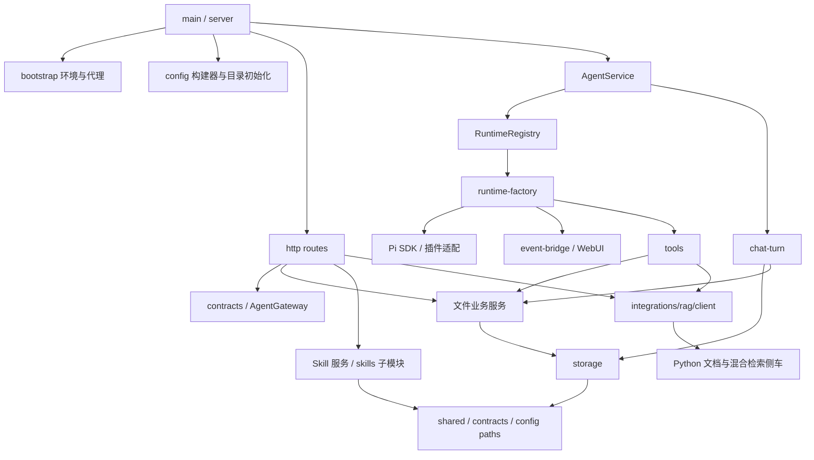

# 重构交付与回归记录

本次基于 `cd2b94029c4b0ffa97bc3ec86e9d05f9ddebc3eb`，在现有 `pi` 分支的干净工作区实施。范围是整个项目的架构梳理、TypeScript 宿主的职责拆分，以及前端聊天模块的拆分；Python 已有的文档入库和检索边界保持原实现并执行回归。没有升级第三方依赖或迁移用户数据。

## 代码获取与阅读范围

使用本地 Git 工作树作为完整项目源码，逐文件阅读 `src/`、`frontend/`、`backend/`、测试、配置、文档以及项目携带的 Skill 说明/示例代码。锁文件按结构解析，核对直接依赖和版本。第三方安装目录、Python 虚拟环境、模型缓存、数据库卷和真实 `.env` 不属于交付源码；没有把用户运行数据或密钥加入交付包。

逐文件职责、入口和依赖见 [源码清单](source-inventory.md)；全部文件路径见 [完整文件树](file-tree.md)。Skill 中的 Anthropic 示例是可选资源，不是 Node/Python 的另一套在线聊天入口。

## 原架构与耦合点

原项目已有浏览器 → Express → Pi Agent 和 Python 知识库侧车三层运行边界。主要问题集中在层内：

| 原位置 | 混合职责 / 耦合 | 目标边界 |
| --- | --- | --- |
| `agent/agent-service.ts` | 会话缓存、模型资源装配、历史恢复、SDK 事件、图片提示、文件收集、消息保存集中在一个类 | facade、registry、factory、event bridge、turn、history/image/artifact adapters |
| `config/index.ts` | 路径、环境参数、模型/权限规则、插件文件写入、ID 校验混在一个导入入口 | paths/models + 独立配置构建器 + runtime layout + shared validation |
| `services/skill-service.ts` | YAML、ZIP 路径校验、安装回滚、目录扫描、CRUD | metadata/archive/installer/catalog/types，保留原服务入口 |
| 文件服务 | `Express.Multer.File` 把 HTTP 类型带入业务层 | `UploadedFile` / `UploadedImage` 结构契约 |
| 会话存储 | 从 artifact-service 引用数据类型，产生底层对业务层的反向依赖 | `contracts/artifacts` / `contracts/sessions` |
| HTTP 路由 | 参数类型依赖整个 AgentService；多个 catch 重复响应格式；未捕获异常返回 HTML | `AgentGateway`、公共错误响应和兜底中间件 |
| `main.ts` | 网络代理和插件环境初始化混在入口 | bootstrap/proxy + bootstrap/environment，保持 SDK 延后导入 |
| `workspace-service.ts` | 工作区存储与 Windows COM 选择器混合 | 原生选择器移入 integrations/system |
| `frontend/js/chat.js` | 请求提交、SSE 解码、消息分段、交互回答和历史加载混合 | chat / chat-stream / chat-messages / history |

未发现需要删除的真实模块循环；重构后对所有 TypeScript 相对依赖执行 AST 检查，包含类型导入、再导出和字面量动态导入。此检查比原先的少量正则边界检查更完整。`@getpipher/vision` 的变量动态导入是显式的第三方兼容边界，不属于本地循环图。

## 实施后的依赖方向



精确到文件的完整图见 [TypeScript 依赖图](dependencies.mmd)。`config/index.ts`、`http/shared.ts`、原 service 的导出仍作为兼容入口，生产内部代码使用明确的叶子模块路径。

## 数据流与生命周期

1. `main.ts` 加载 dotenv，配置代理和插件目录，随后动态导入 `server.ts`。服务组装时创建配置文件，绑定回环地址，保留原启动命令。
2. `/chat/stream` 校验输入、读取工作区和保存图片，通过 `AgentGateway` 提交 `ChatOptions`。SSE 事件字段和 `[DONE]` 完成标记保持不变。
3. `AgentService` 在首次异步初始化前占用该用户/会话的请求槽，所有退出分支均释放。`RuntimeRegistry` 管理就绪 Runtime；初始化期间单独暴露交互/取消通道，使插件启动确认可被回答，绑定失败后移除该通道。
4. `runtime-factory` 装配 Pi 设置、模型、资源、知识库/视觉/交付工具，调用 `restore-messages` 恢复已有文本与历史图片路径，再订阅 `event-bridge` 并绑定 WebUI。
5. `chat-turn` 在轮次边界重载 Skill；准备图片与提示；先保存用户消息，再累计模型文本和来源；最后校验交付文件并保存助手消息。模型异常仍保留已生成的部分回复，再向上抛出。
6. `AbortSignal` 贯穿初始化和执行。重载或读附件期间取消，不再启动后续模型请求。轮次失败或完成均解除事件出口，避免关闭的 HTTP 响应继续被插件持有。
7. 前端按原 `Object.assign` 机制装配 Vue 方法，HTML 明确加载拆分后的三个脚本；状态、方法名、样式和旧消息兼容逻辑保留。

## 外部 API 与行为兼容

所有既有 HTTP 路径、方法、成功响应字段、SSE 事件格式、三个自定义工具名称/参数、JSON 历史结构、环境变量默认值、Pi 版本和 Python API 保持原契约。`createApplication` 接受结构化接口，使假 Agent 无需伪装成具体实现。

错误处理沿用路由原来的 400/409/410/422/500/503 语义。Skill 冲突改用 `AppError.status`，不再比较中文消息字符串。原先绕过路由 catch 的 JSON 解析、上传和异步异常现在统一返回 `{ detail }`，保留已有错误状态码；这是错误响应格式的有意统一，原先这些异常可能返回 Express 默认 HTML。

修复了生命周期边界：初始化失败时释放已创建的 Pi session；取消后不继续启动模型；准备/持久化失败后解除事件出口。没有改变工具决策、提示词、检索算法或用户文件操作规则。

## 原功能清单与验证对照

| 功能 | 重构后位置 | 验证依据 / 结果 |
| --- | --- | --- |
| 环境、代理、插件缓存目录和延后初始化 | bootstrap + main | 真实启动冒烟通过；代理外网连通性未测 |
| 模型、视觉、权限与插件配置文件 | config 各模块 | 原实现生成的三组完整 JSON 基准逐项相等 |
| 本机页面与静态资源 | http/app | HTTP 测试；真实启动读取 8 个页面/资源通过 |
| Host/Origin 访问限制 | http/app | 跨源请求 403，Agent 不执行 |
| 会话请求互斥、重用和工作区切换 | AgentService / RuntimeRegistry | 初始化阶段互斥、失败后重试、精确用户销毁通过 |
| 主模型会话、原工具与历史恢复 | runtime-factory / restore-messages | 假 SDK 验证工具清单、RPC 绑定、历史字段；真实模型调用未测 |
| 流式文本与工具执行状态 | event-bridge / chat-stream | SDK 事件协议测试、HTTP SSE 测试通过 |
| 前端 UTF-8 增量解码和状态装配 | chat-stream / chat-messages | 分割为 3 字节片段的中文 SSE 回归通过 |
| 停止任务与交互取消 | AgentService / WebUI | 初始化、执行、重载期间取消通过 |
| 插件初始化期间的人机交互 | RuntimeRegistry 初始化通道 | 未就绪时能回答；失败后交互入口失效 |
| 选择、输入、确认及过期回答 | WebUI / chat route | 选项校验、取消、过期 410 通过 |
| 工作区校验与保存 | workspace-service | 绝对路径、文件夹和持久化测试通过 |
| Windows 原生文件夹选择 | integrations/system | 原实现机械迁移，未弹出真实选择器 |
| 图片保存与路径限制 | upload-service / prompt-images | 已有图片路径边界测试通过；真实视觉供应商未测 |
| 文件登记、路径保护和下载 | artifact-service / collect-artifacts / artifacts route | 已登记/未登记、敏感路径、自动写入收集通过 |
| 文本、来源、图片引用及交付记录保存 | chat-turn / session-store | 原字段格式、文本拼接、失败部分回复保存通过 |
| 历史页面、旧状态恢复 | history.js / app-core | 旧 memory 页面状态迁回 chat，保留消息/草稿通过 |
| Skill 创建、Markdown/ZIP 上传与列表 | skill-service / skills/* | 创建、资源计数、主文件名规范、无效覆盖保护通过 |
| Skill 冲突、删除与下一轮热载 | installer / RuntimeRegistry | 原路由错误映射保留；重载失败下轮重试通过 |
| 插件发现与运行配置展示 | plugin-resources / configuration route | 真实启动发现 8 个插件 manifest，错误列表为空 |
| 知识库文档代理与检索工具 | integrations/rag/client / tools | TypeScript 导入与类型检查通过；代理保持原转发方式 |
| 文档解析、三级父子分块、上传失败保护 | backend/knowledge + api | Python 16 项测试通过 |
| 初始召回、扩展查询、基础设施异常 | backend/retrieval | 假模型/检索回归通过；真实 Milvus/BGE 链路未测 |
| Pi 记忆、网页、子 Agent、诊断等扩展 | 原已锁定插件 | 资源发现通过；各插件的真实任务未逐个执行 |
| 已下线 memory API | Node / Python routes | 原 404 行为通过 |

## 验证结果

2026-09-03，本机 Node `v24.15.0`，TypeScript `5.9.2`，Pi SDK `0.84.4`。重构前：类型检查通过、Node 19 项、Python 16 项通过。重构后：Node 46 项（14 个测试文件）、Python 16 项通过，类型检查和 Python 编译检查通过。`npm ls --depth=0` 未报告缺失直接依赖。

真实 Node 启动冒烟通过，使用操作系统分配的端口，只关闭冒烟脚本自己创建的服务。健康接口返回 `ok: true`，插件清单可读，静态文件可用；本次 `rag: false`，因此不能把结果解释为模型供应商或 Milvus 已联调成功。

```powershell
npm run check
npm run test:architecture
npm run test:rag
uv run python -m compileall -q backend
npm run test:smoke
npm run export:source
```

启动方式仍为 `npm start` / `npm run dev`，知识库依赖与环境变量见 [README](../README.md) 和 [配置说明](configuration.md)。`test:smoke` 会按真实启动流程写入宿主生成配置；它不发送聊天或知识库检索请求。

## 交付文件

`npm run export:source` 导出当前 Git 工作树中所有已跟踪文件及未忽略的新增文件，保留相对路径和完整文件内容。输出位于 `tmp/delivery/`：

- `refactored-source.zip`：完整源码与配置模板、文档、锁文件、Skill 资源、测试。
- `source-code.md`：所有交付文件内容，逐文件代码块展示。
- `source-manifest.json`：每个文件的大小及 SHA-256；导出脚本重新打开 ZIP 逐项验证。

`docs/file-tree.md` 是完整文件树；`docs/source-inventory.md` 是逐文件阅读记录；`docs/dependencies.mmd` 是精确 TypeScript 依赖图。本次改动保留在工作区，未创建提交。

## 保留的设计边界

Python 知识库继续共享项目级 Milvus/BM25/父块数据，文档替换不是跨存储事务；前端继续使用 CDN 的 Vue/marked 等依赖；会话恢复仍只重建已有用户/助手消息。这些是原实现边界，不属于本次拆模块引入的变化。`agent_workspace` 中部分沿用的资源提及旧执行路径，应按当前宿主系统提示与 README 的工作区规则解释，未批量改写其指令内容。
